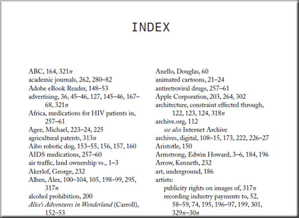

# COMPUTER SCIENCE NOTES

Maintained by [**Sadman Kabir Soumik**](https://www.linkedin.com/in/sksoumik/)

---

# Difference between constant time vs linear time

In time-complexity,

**Constant time** O(1) means, the algorithm doesn't depend on the size of the input. If the size of the container(e.g arrays) grow/increase, the execution time for some operation will remain same.

**Linear time** O(n) means, the algorithm depends on the size of the input. If the size of the container (e.g. arrays) increases, the execution time for some operation will also increase.

# Time complexity

| Name        | Running time | example algorithms                                    |
| ----------- | ------------ | ----------------------------------------------------- |
| constant    | O(1)         | Finding the median value in a sorted array of numbers |
| logarithmic | O(log n)     | Binary search                                         |
| Linear      | O(n)         | Find duplicate elements in array with hash map        |
| Quadratic   | O(n^2)       | Bubble sort, Insertion sort                           |
| Cubic       | O(n^3)       |                                                       |
| Exponential | O(2^n)       | Find all subsets                                      |
| Factorial   | O(n!)        | Find all permutations of a given set/string           |

# DFS, BFS

| DFS                                                          | BFS                                                          |
| ------------------------------------------------------------ | ------------------------------------------------------------ |
| Stack                                                        | Queue                                                        |
| LIFO                                                         | FIFO                                                         |
| Stacking Plates                                              | Queue in front of a elevator                                 |
| DFS is more suitable when there are solutions away from source. | BFS is more suitable for searching vertices which are closer to the given source. |
| when we want to know the all possible results                | when we want to find the shortest path (simple graph). we usually use bfs,it can guarantee the 'shortest'. |

# What is gradient

A **gradient** is a derivative of a function that has more than one input variable. 

# Data standardization vs Normalization

**Normalization** typically means rescales the values into a **range of [0,1]**. 

**Standardization**: typically means rescales data to have a **mean of 0** and a **standard deviation of 1** (unit variance). 

# Why do we normalize data

For machine learning, every dataset does not require normalization. It is required only when features have different ranges. 

For example, consider a data set containing two features, age(x1), and income(x2). Where age ranges from 0–100, while income ranges from 0–20,000 and higher. Income is about 1,000 times larger than age and ranges from 20,000–500,000. So, these two features are in very different ranges. When we do further analysis, like multivariate linear regression, for example, the attributed income will intrinsically influence the result more due to its larger value. But this doesn’t necessarily mean it is more important as a predictor.

Because different features do not have similar ranges of values and hence **gradients may end up taking a long time** and can oscillate back and forth and take a long time before it can finally **find its way to the global/local minimum**. To overcome the model learning problem, we normalize the data. We make sure that the different features take on similar ranges of values so that **gradient descents can converge more quickly**.

# When Should You Use Normalization And Standardization

**Normalization** is a good technique to use when you do not know the distribution of your data or when you know the distribution is not Gaussian (a bell curve). Normalization is useful when your data has varying scales and the algorithm you are using does not make assumptions about the distribution of your data, such as k-nearest neighbors and artificial neural networks.

**Standardization** assumes that your data has a Gaussian (bell curve) distribution. This does not strictly have to be true, but the technique is more effective if your attribute distribution is Gaussian. Standardization is useful when your data has varying scales and the algorithm you are using does make assumptions about your data having a Gaussian distribution, such as linear regression, logistic regression, and linear discriminant analysis. 

Normalization -> Data distribution is not Gaussian (bell curve).

Standardization -> Data distribution is Gaussian (bell curve). 

# Vanishing Gradient Problem

As more layers using certain activation functions are added to neural networks, the **gradients of the loss function approaches zero**, making the network hard to train. 

However, when *n* hidden layers use an activation like the sigmoid function, *n* small derivatives are multiplied together. Thus, the gradient decreases exponentially as we propagate down to the initial layers.

The simplest solution is to use other activation functions, such as ReLU, which doesn’t cause a small derivative.

# Why ReLU

 **ReLu is** faster to compute than the **sigmoid** function, and its derivative **is** faster to compute. This makes a significant difference to training and inference time for neural networks. 

Main benefit is that the derivative/gradient of ReLu is either 0 or 1, so multiplying by it won't cause weights that are further away from the end result of the loss function to suffer from the vanishing gradient. 

# PyTorch Tutorial

See some great resources [here](static/pytorch tutorials.pdf)

# Computer shortcuts

#### Chrome

- Show all bookmarks to search: `ctrl + shift + O`
- Move between tabs: `ctrl + fn + up/down arrow`
- Go end of the page: `ctrl + fn + right arrow`
- Go at the beginning of a list: `ctrl + fn + left arrow`

#### vscode

- Vscode: select the same word in the whole file: point the cursor in any word that you want to select then press `ctrl + D`
- Vscode: Open User Settings: `CTRL + ,`
- VSCode: Quick Open a File: `CTRL + P`
- VScode: Tab Through Open Files: `CTRL + Tab`
- Vscode: Move File to Split Windows = `CTRL + \ `
- Vscode: Navigating Text/ move a line up or down: Hold `ALT` when moving `left and right` through text to move faster.

#### Linux

- Move among opened tabs: `ctrl + fn + up/down arrow`
- Change workspace: `ctrl + alt + right/left arrow`
- Selecting multiple place mouse cursor: press `alt + shift + D` and then use `up/down` arrow.

#### Linux Terminal

- add a custom command in linux terminal: `alias custom_command='original_command'`
- delete a folder from linux including all files `sudo rm -r folder_name`

- Delete all files from the current directory `sudo rm ./*`

- Clean up root disk in Linux | dev/sda1 disk full problem

  `sudo apt-get install ncdu`
  `sudo ncdu / (too see all files size in root dir)`
  or
  `ncdu` (see files sizes in the current directory)

- Download youtube videos as mp3 youtube-dl `youtube-dl -f bestaudio --extract-audio --audio-format mp3 --audio-quality 0 <URL>`

- Create a new file: `cat filename`
- Zip a folder with a name: `zip -r file_name.zip targer_folder_name/`
- Open a folder in file explorer using Linux Terminal: `xdg-open folder`
- copy or move files from subdirectories that ends with a common extension: `mv **/*.csv target_dir`
- Install VS Code from terminal: [read here](https://linuxize.com/post/how-to-install-visual-studio-code-on-ubuntu-18-04/)
- Get the size of a file (human-readable): `du -sh <file-name>`
- Search for a file in the current directory: `find *<file-name-portion>*`
- rename a folder: `vm old_name new_name`
- `Ctrl + L` : equivalent to `clear`
- `Ctrl + U`: This shortcut erases everything from the current cursor position to the beginning of the line.
- `Ctrl + A`: Move the cursor to the beginning of the line.
- `Ctrl + E`: This shortcut does the opposite of `Ctrl + A`. It moves the cursor to the end of the line.
- Display first 3 lines of a file in the terminal: `head -3 filename`

#### Anaconda commands

- create a new venv
  `conda create -n myenv python=3.6`
- create anaconda env file from terminal
  `conda env export > conda.yaml`
- Creating new anaconda environment using a yaml file: `conda env create --file dependency.yaml`
- remove a venv from anaconda
  `conda env remove -n env_name`
- Remove any anaconda env: `conda env remove -n env_name`
- Remove any package from an environment: activate the target env and `conda remove package_name`

#### GCP commands

- Connect with the instance from terminal:
  `gcloud compute config-ssh`
  `ssh soumik.us-west1-b.project_name`

- After creating VM Instance configure from the local PC:
  `gcloud config set project project_name`
  `gcloud compute config-ssh`

- Copy file from instance to GCP workspace:
  `sudo gsutil cp gs://ceri_snow_unified/CERI_snow_10sec/csv/kfold.csv .`

- Copying files from GCP instance to local computer:
  `gsutil -m cp -r gs://project_location/ ${loca_pc_dest_path}`

  for example:
  `gsutil -m cp -r gs://ceri_snow_unified/CERI_snow_10sec/ C:/Users/Dell/code/ceri_test_windows`

- See how much space left on GCP: `df -h`
- Upload files from bucket to instance: `gsutil -m cp -R gs://bucket_location_gs_path .`
- Download file from gcp bucket to an instance (. means current directory)
  `gsutil -m cp -r gs://bucket_location .`

- Untar files: `tar -xf filename.xz`

- Transfer (copy) file from GCP instance to Cloud Storage Bucket: (run from the instance workplace)

  `gsutil cp filename gs://bucket_name`

- Transfer/Copy file/folder from Cloud Storage Bucket to the local computer: (Open terminal in your local computer and navigate to the folder where you need the file to be copied and run this command):

  `gsutil -m cp -r gs://bucket_name/folder .`

- Clean up root disk in Linux | dev/sda1 disk full problem | see which files are taking what space in the disk:

  - install ncdu: `sudo apt-get install ncdu`
  - to see all file/folder size in the root directory of disk: `sudo ncdu /`
  - to see all file/folder size in the current directory of disk: `ncdu .`

#### Git

- See a git cheatsheet: [[here](/static/git-cheat-sheet-education.pdf)]

- create a new branch without adding any content from the master branch (empty branch)

  `git checkout --orphan branchname`

  `git rm -rf .`

- revert back to a specific commit:

  `git reset --hard <commit_id>`

  `git push -f origin master`

- create a new branch and switch to it at the same time:

`git checkout -b <branch_name>`

- Add agent:

  ```shell
  eval `ssh-agent -s`
  ssh-add
  ```

- update a branch with the master:

  ```bash
  git checkout <branch_name>
  git merge main
  ```

#### Kaggle

- download kaggle dataset: `kaggle datasets download [username/dataset name (just copy the url after kaggle.com)]`

# Useful Notebooks

1. **[Bringing Old Photos Back to Life](https://github.com/microsoft/Bringing-Old-Photos-Back-to-Life)** [Notebook](https://colab.research.google.com/drive/1NEm6AsybIiC5TwTU_4DqDkQO0nFRB-uA?usp=sharing)

2. **[first order model](https://github.com/AliaksandrSiarohin/first-order-model)** Notebook

3. [Get SH\*T Done with PyTorch](https://github.com/curiousily/Getting-Things-Done-with-Pytorch)

4. PyTorch Transformers [Tutorials](https://github.com/abhimishra91/transformers-tutorials)

5. **[huggingtweets](https://github.com/borisdayma/huggingtweets)**

6. Shadow removal from image. [Colab](https://colab.research.google.com/drive/1cJ_dsBUXFaFtjoZB9gDYeahjmysnvnTq)

7. What does a CNN see? [Colab](https://colab.research.google.com/drive/1xM6UZ9OdpGDnHBljZ0RglHV_kBrZ4e-9#scrollTo=ZP9p7mH6RJXp)

# NLP Intro

- Concepts of Bag-of-Words (BoW) and TF-IDF come into play. Both BoW and TF-IDF are techniques that help us convert text sentences into **numeric vectors**. [Read](https://www.analyticsvidhya.com/blog/2020/02/quick-introduction-bag-of-words-bow-tf-idf/)
- BERT tokenizer does the preprocessing by itself, so usually you don't benefit from standard preprocessing.
- Transformer models: read [here](https://medium.com/inside-machine-learning/what-is-a-transformer-d07dd1fbec04)
- Common pre-processing techniques:
  1. Removes unicode strings like.
  2. Removes URL strings like.
  3. Removes emoticons from text.
  4. Remove Punctuation (`string.punctuation` or using regular expression).
  5. Convert all words to one case.
  6. Filter out Stop Words (e.g. **Stopwords** are the most common **words** in any natural language. For example, "the”, “is”, “in”, “for”, “where”, “when”, “to”, “at” etc.)
  7. _Stemming:_ A technique that takes the word to its root form. It just removes suffixes from the words. (`nltk.PorterStemmer()` / `nltk.SnowballStemmer()`).

# SVM

Support Vector Machine (SVM) is a supervised machine learning algorithm that can be used for **both classification or regression** challenges. The model extracts the best possible hyper-plane / line that segregates the two classes.

# Random Forest Model

Random Forest models are a type of **ensemble** models, particularly **bagging** models. They are part of the tree-based model family.

# Microsoft -vs- Google

Microsoft is an enterprise software company driven by **license revenue**, while Google is a consumer Internet company driven by **advertising revenue**.

# Enterprise software vs Consumer software

Enterprise software is just another term for business software. This is software that is **sold to (or targeted at) companies, not to individuals.** So, all the software which you use on a general basis like Windows or **Google or Quora is consumer software.**

Enterprise software is sold to companies to solve their problems. This can cover a wide range of applications, from software to manage the employees like payroll, attendance, promotions etc. (HRM), interacting with customers like the one’s marketing, sales.

# Text classification

###### **Approaches to automatic text classification can be grouped into three categories:**

- Rule-based methods
- Machine learning (data-driven) based methods
- Hybrid methods

###### **neural network architectures, such as models based on**

- recurrent neural networks (RNNs),
- Convolutional neural networks (CNNs),
- Attention,
- Transformers,
- Capsule Nets

# Batch Size

- **Batch Gradient Descent**. Batch size is set to the total number of examples in the training dataset.
- **Stochastic Gradient Descent**. Batch size is set to one.
- **Minibatch Gradient Descent**. Batch size is set to more than one and less than the total number of examples in the training dataset.

# Python’s built-in `sorted()` function

The built-in sorting algorithm of Python uses a special version of merge sort, called Timsort, which runs in O(n log n) on average and worst-case both.

# Permutations vs Anagrams vs Palindromes

Check Permutation: Given two strings, write a method to decide if one is a permutation of the other.

I’m working through algorithm exercises with a group of people, and there was a lot of confusion about what permutation means, and how it differs from anagrams and palindromes.

So, to clarify:

A permutation is one of several possible variations, in which a set of things (like numbers, characters or items in an array) can be ordered or arranged. A permutation of characters does not have to have meaning.

Example: Given the string abcd, the permutations are abcd, abdc, acbd, acdb, adbc, adcb, bacd, badc, bcad, bcda, bdac, bdca, cabd, cadb, cbad, cbda, cdab, cdba, dabc, dacb, dbac, dbca, dcab and dcba

An anagram is a word, phrase, or name formed by rearranging the characters of a string. An anagram must have meaning, it can’t just be gibberish.

Example: These words are anagrams of carets: caters, caster, crates, reacts, recast, traces

A palindrome is a word, phrase, or sequence that reads the same backward as forward. A palindrome must have meaning, it can’t just be gibberish.

Example: Civic, level, madam, mom and noon are all palindromes.

All palindromes and anagrams are permutations, but not all permutations are either anagrams or palindromes.

# What to do when you can’t find the solution?

- Use a jupyter notebook to debug the code.
- Search similar problems in GitHub, Kaggle, Medium, YouTube, StackOverflow
- Break-down the problem into smaller parts and understand what you really need to do.

# Multi-class Text Classification

- For multi-class classification: loss-function: categorical cross entropy (For binary classification: binary cross entropy loss).
- BERT: Take a pre-trained BERT model, add an untrained dense layer of neurons, train the layer for any downstream task, …

# Backpropagation

The backward function contains the backpropagation algorithm, where the goal is to essentially minimize the loss with respect to our weights. In other words, the weights need to be updated in such a way that the loss decreases while the neural network is training (well, that is what we hope for). All this magic is possible with the gradient descent algorithm.

# Activation function vs Loss function

An Activation function is a property of the neuron, a function of all the inputs from previous layers and its output, is the input for the next layer.

If we choose it to be linear, we know the entire network would be linear and would be able to distinguish only linear divisions of the space.

Thus we want it to be non-linear, the traditional choice of function (tanh / sigmoid) was rather arbitrary, as a way to introduce non-linearity.

One of the major advancements in deep learning, is using ReLu, that is easier to train and converges faster. but still - from a theoretical perspective, the only point of using it, is to introduce non-linearity. On the other hand, a Loss function, is the goal of your whole network.

it encapsulate what your model is trying to achieve, and this concept is more general than just Neural models.

A Loss function, is what you want to minimize, your error. Say you want to find the best line to fit a bunch of points:

_D_={(*x*1,*y*1),…,(_x\*\*n_,_y\*\*n_)}

$$
D={(x1,y1),…,(x**n,y**n)}
$$

Your model (linear regression) would look like this:

`y=mx+n`

And you can choose several ways to measure your error (loss), for example L1:

or maybe go wild, and optimize for their harmonic loss:

# t-SNE algorithm

(**t**-**SNE**) **t**-Distributed Stochastic Neighbor Embedding is a non-linear dimensionality reduction algorithm **used for** exploring high-dimensional data. It maps multi-dimensional data to two or more dimensions suitable for human observation.

# Cross-Validation data

We should not use augmented data in cross validation dataset.

# Concurrency and parallelism

**Concurrency** and **parallelism** both relate to "different things happening more or less at the same time.

https://fastapi.tiangolo.com/async/#in-a-hurry

# Daemon in Linux

A **daemon** (pronounced DEE-muhn) is a program that runs continuously and exists for the purpose of handling periodic service requests that a computer system expects to receive. The **daemon** program forwards the requests to other programs (or processes) as appropriate. For example, the **Cron** daemon is a built-in **Linux** utility that runs processes on your system at a scheduled time. We can configure a **cron** job to schedule scripts or other commands to run automatically.

# Pickle vs JSON for serialization

https://docs.python.org/3/library/pickle.html#comparison-with-json

# Hyper-parameter optimization techniques

- Grid Search
- Bayesian Optimization.
- Random Search

# Normalization in ML

Normalizing helps keep the network weights near zero which in turn makes back-propagation more stable. Without normalization, networks will tend to fail to learn.

# Why do call `scheduler.step()` in pytorch?

If you don’t call it, the learning rate won’t be changed and stays at the initial value.

# Momentum and Learning rate dealing

If the LR is low, then momentum should be high and vice versa. The basic idea of momentum in ML is to **increase the speed of training**.

Momentum helps to know the direction of the next step with the knowledge of the previous steps. It helps to prevent oscillations. A typical choice of momentum is between **0.5 to 0.9**.

# YOLO

You only look once (YOLO) is SOTA real-time object detection system.

# Object Recognition

[Ref link](https://machinelearningmastery.com/object-recognition-with-deep-learning/)

Object classification + Object localization (bbox) = Object detection

Object classification + Object localization + Object detection = Object Recognition (Object detection)

# CRUD

In computer programming, **create, read, update, and delete** (CRUD) are the four basic functions of persistent storage.

# SQL vs NoSQL

**SQL:**

- Relational database.
- Organize data into one or more tables.
- Each table has rows and columns.
- An unique identifier is added in each row.
- B+ tree is the main data structure

Relational database management systems: mysql, postgresql, mariadb, oracle etc.

**NoSQL**

- Non-relational.
- Organize data in a key:value pair.
- Mainly documents in JSON/XML format.
- LSM-tree (Long structured merge -tree) is the main data structure.

NoSQL management systems: MongoDB, firebase, apache cassandra etc.

**Foreign key** is just the primary key of another table. So that we can make a relationship between two tables.

**LSM-tree**: read [here](http://www.shafaetsplanet.com/?p=3796)

# SQL Basics

##### Basic statements

- SQL statements fall into two different categories: Data Definition Language (DDL) statements and Data Manipulation Language (DML) statements.

  

Read more details from [here](https://www.javatpoint.com/dbms-sql-command)

**Query statement (retrieve data): ** SELECT

**DDL (data definition language)**: Create, Drop, Alter, Truncate

**DML (Data manipulation language) statement:** INSERT, UPDATE, DELETE

##### Select Rule | Query data from a table

```sql
SELECT column_name
FROM Table_name
WHERE Conditions;
```

##### Insert Rule | Inser new data in a table

```sql
INSERT INTO table_name (column1, column2, ... )
VALUES (value1, value2, ... );
```

Example, insert one row

```sql
INSERT INTO Instructor(ins_id, lastname, firstname, city, country)
VALUES(4, 'Saha', 'Sandip', 'Edmonton', 'CA');
```

Example, insert multiple row

```sql
INSERT INTO Instructor(ins_id, lastname, firstname, city, country)
VALUES(5, 'Doe', 'John', 'Sydney', 'AU'), (6, 'Doe', 'Jane', 'Dhaka', 'BD');
```

##### Update Rule | Alter information in a table

```sql
UPDATE table_name
SET column1 = value1, column2 = value2, ...
WHERE condition;
```

Example, update data

```sql
UPDATE Instructor
SET city='Toronto'
WHERE firstname="Sandip";
```

Example, update multiple columns

```sql
UPDATE Instructor
SET city='Dubai', country='AE'
WHERE ins_id=5;
```

##### Delete | Remove one or more rows from a table

```sql
DELETE FROM table_name
WHERE condition;
```

Example, delete one row from the table

```sql
DELETE FROM Instructor
WHERE ins_id = 6;
```

##### JOIN statement

A SQL Join statement is used to combine data or rows from two or more tables based on a common field between them. Different types of Joins are:

- INNER JOIN
- LEFT JOIN
- RIGHT JOIN
- FULL JOIN

##### Aggregate Functions

An aggregate function performs a calculation on a set of values, and returns a single value. Except for `COUNT(*)`, aggregate functions ignore null values. Aggregate functions are often used with the `GROUP BY` clause of the SELECT statement.

Various aggregate functions are:

```sql
1) Count()
2) Sum()
3) Avg()
4) Min()
5) Max()
```

##### Few clauses that is used with the select statement

**COUNT:** retrieves the number of rows

**DISTINCT** is used to remove duplicate values from a result set.

**LIMIT**: restricting the number of rows retrieved from the database.

## Entity -relationship diagrams

Entity: Table

Attribute: Columns

##### Data type, CHAR vs VARCHAR

A CHAR field is a *fixed* length, and VARCHAR is a *variable* length field.

This means that the storage requirements are different - a CHAR always takes the same amount of space regardless of what you store, whereas the storage requirements for a VARCHAR vary depending on the specific string stored. 

CHAR fields are stored inside the register due to its size being known, this makes searching and indexing faster. 

##### Indexing in DB

Consider a "Book" of 1000 pages, divided by 10 Chapters, each section with 100 pages.

Now, imagine you want to find a particular Chapter that contains a word "**Alchemist**". Without an index page, you have to scan through the entire book/Chapters. i.e: 1000 pages.

This analogy is known as **"Full Table Scan"** in database world.



But with an index page, you know where to go! And more, to lookup any particular Chapter that matters, you just need to look over the index page, again and again, every time. After finding the matching index you can efficiently jump to that chapter by skipping the rest.

But then, in addition to actual 1000 pages, you will need another ~10 pages to show the indices, so totally 1010 pages.

> Thus, the index is a separate section that stores values of indexed column + pointer to the indexed row in a sorted order for efficient look-ups.


##### Normalization

Normalization is a **database design technique** that reduces data redundancy and eliminates undesirable characteristics like Insertion, Update and Deletion Anomalies. Normalization rules divides larger tables into smaller tables and links them using relationships.

If a table is not properly normalized and have data redundancy then it will not only eat up extra memory space but will also make it difficult to handle and update the database, without facing data loss. Insertion, Updation and Deletion Anomalies are very frequent if database is not normalized.

###### 1NF

1. It should only have single(atomic) valued attributes/columns.
2. All the columns in a table should have unique names.

###### 2NF

1. Should be in 1NF.
2. Single column primary column. There should be no partial dependency. 

##### 3NF

1. satisfy 2NF.
2. 

# Target Value Types

Categorical variables can be:

1. Nominal
2. Ordinal
3. Cyclical
4. Binary

Nominal variables are variables that have two or more categories which do not have any kind of order associated with them. For example, if gender is classified into two groups, i.e. male and female, it can be considered as a nominal variable.Ordinal variables, on the other hand, have “levels” or categories with a particular order associated with them. For example, an ordinal categorical variable can be a feature with three different levels: low, medium and high. Order is important.As far as definitions are concerned, we can also categorize categorical variables as binary, i.e., a categorical variable with only two categories. Some even talk about a type called “cyclic” for categorical variables. Cyclic variables are present in “cycles” for example, days in a week: Sunday, Monday, Tuesday, Wednesday, Thursday, Friday and Saturday. After Saturday, we have Sunday again. This is a cycle. Another example would be hours in a day if we consider them to be categories.

# Confusion Matrix

Let's say, we have a dataset which contains cancer patient data (Chest X-ray image), and we have built a machine learning model to predict if a patient has cancer or not.

**True positive (TP):** Given an image, if your model predicts the patient has cancer, and the actual target for that patient has also cancer, it is considered a true positive. Means the prediction is True.

**True negative (TN):** Given an image, if your model predicts that the patient does not have cancer and the actual target also says that patient doesn't have cancer it is considered a true negative. Means the prediction is True.

**False positive (FP):** Given an image, if your model predicts that the patient has cancer but the the actual target for that image says that the patient doesn't have cancer, it a false positive. Means the model prediction is False.

**False negative (FN):** Given an image, if your model predicts that the patient doesn't have cancer but the actual target for that image says that the patient has cancer, it is a false negative. This prediction is also false.

# When not to use accuracy as Metric

If the number of samples in one class outnumber the number of samples in another class by a lot. In these kinds of cases, it is not advisable to use accuracy as an evaluation metric as it is not representative of the data. So, you might get high accuracy, but your model will probably not perform that well when it comes to real-world samples, and you won’t be able to explain to your managers why. In these cases, it’s better to look at other metrics such as precision.

# Common Evaluation Metrics in ML

If we talk about **classification problems**, the most common metrics used are:

- Accuracy

- Precision (P)
- Recall (R)
- F1 score (F1)
- Area under the ROC (Receiver Operating Characteristic) curve or simply AUC (AUC)
- Log loss- Precision at k (P@k)
- Average precision at k (AP@k)
- Mean average precision at k (MAP@k)

When it comes to **regression**, the most commonly used evaluation metrics are:

- Mean absolute error (MAE)
- Mean squared error (MSE)
- Root mean squared error (RMSE)
- Root mean squared logarithmic error (RMSLE)
- Mean percentage error (MPE)
- Mean absolute percentage error (MAPE)- R2

# Autoencoder

An **autoencoder** is a type of artificial neural network used to learn efficient data codings in an unsupervised manner. The aim of an **autoencoder** is to learn a representation (encoding) for a set of data, typically for dimensionality reduction.

[See](https://github.com/L1aoXingyu/pytorch-beginner/tree/master/08-AutoEncoder) visual representation and code in pytorch. A great [notebook](https://www.cs.toronto.edu/~lczhang/360/lec/w05/autoencoder.html) from cstoronto.

##### Difference between AutoEncoder(AE) and Variational AutoEncoder(VAE):

The key difference between and autoencoder and variational autoencoder is autoencoders learn a “compressed representation” of input (could be image,text sequence etc.) automatically by first compressing the input (_encoder_) and decompressing it back (decoder) to match the original input. The learning is aided by using distance function that quantifies the information loss that occurs from the lossy compression. So learning in an autoencoder is a form of unsupervised learning (or self-supervised as some refer to it) - there is no labeled data.

Instead of just learning a function representing the data ( a compressed representation) like autoencoders, variational autoencoders learn the parameters of a probability distribution representing the data. Since it learns to model the data, we can sample from the distribution and generate new input data samples. So it is a generative model like, for instance, GANs.

So, VAE are generative autoencoders, meaning they can generate new instances that look similar to original dataset used for training. VAE learns **probability distribution** of the data whereas autoencoders learns a function to map each input to a number and decoder learns the reverse mapping.

# Why PyTorch?

PyTorch’s clear syntax, streamlined API, and easy debugging make it an excellent choice for introducing deep learning. PyTorch’s dynamic graph structure lets you experiment with _every part of the model_, meaning that the graph and its input can be modified during runtime. This is referred to as **eager execution**. It offers the programmer better access to the inner workings of the network than a static graph (TF) does, which considerably eases the process of debugging the code.

Want to make your own loss function? One that adapts over time or reacts to certain conditions? Maybe your own optimizer? Want to try something really weird like growing extra layers during training? Whatever - PyTorch is just here to crunch the numbers - you drive. [Ref: *Ref: Deep Learning with PyTorch - Eli Stevens*]

# PyTorch vs NumPy

PyTorch is not the only library that deals with multidimensional arrays. NumPy is by far the most popular multidimensional array library, to the point that it has now arguably become the lingua franca of data science. PyTorch features seamless interoperability with NumPy, which brings with it first-class integration with the rest of the scientific
libraries in Python, such as SciPy, Scikit-learn, and Pandas. Compared to NumPy arrays, PyTorch tensors have a few superpowers, such as **the ability to perform very fast operations on graphical processing units (GPUs)**, distribute operations on multiple devices or machines, and keep track of the **graph of computations** that created them.

# Frequently used terms in ML

##### Feature engineering

Features are transformations on input data that facilitate a downstream algorithm, like a classifier, to produce correct outcomes on new data. Feature engineering consists of coming up with the right transformations so that the downstream algorithm can solve a
task. For instance, in order to tell ones from zeros in images of handwritten digits, we would come up with a set of filters to estimate the direction of edges over the image, and then train a classifier to predict the correct digit given a distribution of edge directions. Another useful feature could be the number of enclosed holes, as seen in a zero, an eight, and, particularly, loopy twos. [Read this article](https://medium.com/mindorks/what-is-feature-engineering-for-machine-learning-d8ba3158d97a).

##### Tensor

Tensor is multidimensional arrays similar to NumPy arrays.

##### ImageNet

ImageNet dataset (http://imagenet.stanford.edu). ImageNet is a very large dataset of over 14 million images maintained by Stanford University. All of the images are labeled with a hierarchy of nouns that come from the WordNet dataset (http://wordnet.princeton.edu),
which is in turn a large lexical database of the English language.

##### Embedding

An embedding is a relatively low-dimensional space into which you can translate high-dimensional vectors. The embedding in machine learning or NLP is actually a technique mapping from words to vectors which you can do better analysis or relating, for example, "toyota" or "honda" can be hardly related in words, but in **vector space** it can be set to very close according to some measure, also you can strengthen the relation ship of word by setting: king-man+woman = Queen. So we can set boy to (1,0) and then set girl to (-1,0) to show they are in the same dimension but the meaning is just opposite.

##### Baseline

A baseline is the result of a very basic model/solution. You generally create a baseline and then try to make more complex solutions in order to get a better result. If you achieve a better score than the baseline, it is good.

##### Benchmarking

It a process of measuring the performance of a company's products, services, or processes against those of another business considered to be the best in the industry, aka “best in class.” The point of **benchmarking** is to identify internal opportunities for improvement. The same concept applies for the ML use cases as well. For example, It's a tool, comparing how well one ML method does at performing a specific task compared to another ML method which is already known as the best in that category.

##### Bands and Modes of Image

An image can consist of one or more bands of data. The Python Imaging Library allows you to store several bands in a single image, provided they all have the same dimensions and depth. For example, a PNG image might have ‘R’, ‘G’, ‘B’, and ‘A’ bands for the red, green, blue, and alpha transparency values. Many operations act on each band separately, e.g., histograms. It is often useful to think of each pixel as having one value per band.

The mode of an image defines the **type and depth** of a pixel in the image. The current release supports the following standard modes: [Read](https://pillow.readthedocs.io/en/3.0.x/handbook/concepts.html#concept-modes)

##### Mixed-Precision

Mixed precision is the use of both 16-bit and 32-bit floating-point types in a model during training to make it run faster and use less memory. By keeping certain parts of the model in the 32-bit types for numeric stability, the model will have a lower step time and train equally as well in terms of the evaluation metrics such as accuracy.

##### Hyperparameters

With neural networks, you’re usually working with hyperparameters once the data is formatted correctly. A hyperparameter is a parameter whose value is set before the learning process begins. It determines how a network is trained and the structure of the network. Few hyperparameter example:

- Number of hidden layers in the network
- Number of hidden units for each hidden layer
- Learning rate
- Activation function for different layers
- Momentum
- Learning rate decay.
- Mini-batch size.
- Dropout rate (if we use any dropout layer)
- Number of epochs

##### Quantization

Quantization that realizes speeding up and memory saving by replacing the operations of the neural network mainly on floating point operations with integer operations.

This is the most easy way to make inference from trained models which reduce operation costs, reduce calculation loads, and reduce memory consumption.

# Methods for finding out Hyperparameters

1. _Manual Search_

2. _Grid Search_ [(http://machinelearningmastery.com/grid-search-hyperparameters-deep-learning-models-python-keras/](http://machinelearningmastery.com/grid-search-hyperparameters-deep-learning-models-python-keras/))

   In scikit-learn there is a `from sklearn.model_selection import GridSearchCV` class to find the best parameters using GridSearch.

   ```python
   from sklearn.model_selection import GridSearchCV

   model = KerasClassifier(build_fn=create_model, epochs=100, batch_size=10, verbose=0)
   optimizer = ['SGD', 'RMSprop', 'Adagrad', 'Adadelta', 'Adam', 'Adamax', 'Nadam']
   param_grid = dict(optimizer=optimizer)
   grid = GridSearchCV(estimator=model, param_grid=param_grid, n_jobs=-1, cv=3)
   ```

   We can't use the gridsearch directly with PyTorch, but there is a library which is called [skorch](https://github.com/skorch-dev/skorch). Using skorch, we can use the sklearns's gridsearch with PyTorch models.

3. _Random Search_

In scikit-learn there is a Class `from sklearn.model_selection import RandomizedSearchCV` which we can use to do random search. We can't use the random search directly with PyTorch, but there is a library which is called [skorch](https://github.com/skorch-dev/skorch). Using skorch, we can use the sklearn's `RandomizedSearchCV` with PyTorch models.

Read [more ...](https://discuss.pytorch.org/t/what-is-the-best-way-to-perform-hyper-parameter-search-in-pytorch/19943)

4. _Bayesian Optimization_

   There are different libraries for searching hyperparameter, for example: optuna, hypersearch. gridsearchCV in sklearn etc.

# If your machine learning model is 99% correct, what are the possible wrong things happened?

1. Overfitting.
2. Wrong evaluation metric
3. Bad validation set
4. Leakage: you're accidentally using 100% of the training set as your test set.
5. Extreme class imbalance (with, say, 98% in one class) combined with the accuracy metric or a feature that leaks the target.

# SQLite Database Creation: Flask

##

```sql
$ sqlite3 database.db
$ .tables
$ .exit
# define the database path code.
$ python
$ from app import db
$ db.create_all()
$ exit()
# open the database
$ sqlite3 database.db
$ .tables
$ select * from table_name
```

# GAN

GAN, where two networks, one acting as the painter and the other as the art historian, compete to outsmart each other at creating and detecting forgeries. GAN stands for generative adversarial network, where generative means something is being created (in this
case, fake masterpieces), adversarial means the two networks are competing to outsmart the other, and well, network is pretty obvious. These networks are one of the most original outcomes of recent deep learning research. Remember that our overarching goal is to produce synthetic examples of a class of images that cannot be recognized as fake. When mixed in with legitimate examples, a
skilled examiner would have trouble determining which ones are real and which are our forgeries.

The end goal for the generator is to fool the discriminator into mixing up real and fake images. The end goal for the discriminator is to find out when it’s being tricked, but it also helps inform the generator about the identifiable mistakes in the generated images. At the start, the generator produces confused, three-eyed monsters that look nothing like a Rembrandt portrait. The discriminator is easily able to distinguish the muddled messes from the real paintings. As training progresses, information flows back from the discriminator, and the
generator uses it to improve. By the end of training, the generator is able to produce convincing fakes, and the discriminator no longer is able to tell which is which. [ *Ref: Deep Learning with PyTorch - Eli Stevens* ]

##### CycleGAN

An interesting evolution of this concept is the CycleGAN, proposed in 2017. A CycleGAN can turn images of one domain into images of another domain (and back), without the need for us to explicitly provide matching pairs in the training set. It can perform the task of image translation. Once trained you can translate an image from one domain to another domain. For example, when trained on horse and zebra data set, if you give it an image with horses in the ground, the CycleGAN can convert the horses to zebra with the same background. FaceApp is one of the most popular examples of CycleGAN where human faces are transformed into different age groups.

##### StyleGAN

StyleGAN is a GAN formulation which is capable of generating very high-resolution images even of 1024\*1024 resolution. The idea is to build a stack of layers where initial layers are capable of generating low-resolution images (starting from 2\*2) and further layers gradually increase the resolution.

The easiest way for GAN to generate high-resolution images is to remember images from the training dataset and while generating new images it can add random noise to an existing image. In reality, StyleGAN doesn’t do that rather it learn features regarding human face and generates a new image of the human face that doesn’t exist in reality.

##### Text-2-Image

This GAN architecture that made significant progress in generating meaningful images based on an explicit textual description. This GAN formulation takes a textual description as input and generates an RGB image that was described in the textual description.

# CMOS

Stands for "Complementary Metal Oxide Semiconductor." It is a technology used to produce integrated circuits. **CMOS** circuits are found in several types of electronic components, including microprocessors, batteries, and digital camera image sensors.

# Profiling

In software engineering, profiling is a form of dynamic program analysis that measures, for example, the space or time complexity of a program, the usage of particular instructions, or the frequency and duration of function calls. Most commonly, profiling information serves to aid program optimization.

# Tensors


1. https://www.youtube.com/watch?v=otDOHt_Jges&t=617s)

# Babel

**Babel** is a **transpiler** that converts our ultra-modern JavaScript syntax to browser-readable JavaScript, HTML, and CSS.

# HTML class vs ID

The **difference** between an **ID** and a **class** is that an **ID** is only used to identify **one single element** in our **HTML**. ... However, a **class** can be used to identify more than one **HTML** element.

# Vue.js commands

```bash
# check vue version
$ vue --version
# create the app from the current directory
$ vue create <app-name>
# run the app to browser
$ npm run serve

```

# Abstract class

An **abstract class** is a **class** that is declared **abstract** —it may or may not include **abstract** methods. **Abstract classes** cannot be instantiated, but they can be subclassed. Abstract classes are classes that contain one or more abstract methods. An abstract method is a method that is declared, but contains **no implementation**. Abstract classes **cannot be instantiated**, and require subclasses to provide implementations for the abstract methods.

Python on its own doesn't provide abstract classes. Yet, Python comes with a module which provides the infrastructure for defining Abstract Base Classes (ABCs). This module is called - for obvious reasons - **abc**.

The following Python code uses the abc module and defines an abstract base class:

```python
from abc import ABC, abstractmethod

class AbstractClassExample(ABC):

    def __init__(self, value):
        self.value = value
        super().__init__()

    @abstractmethod
    def do_something(self):
        pass
```

We will define now a subclass using the previously defined abstract class. You will notice that we haven't implemented the `do_something` method, even though we are required to implement it, because this method is **decorated** as an abstract method with the decorator "`abstractmethod`". We get an exception that Add42 can't be instantiated.

```python
class Add42(AbstractClassExample):
    pass

x = Add42(4)
```

Output:

```bash
---------------------------------------------------------------------------
TypeError                                 Traceback (most recent call last)
<ipython-input-4-2bcc42ab0b46> in <module>
      2     pass
      3
----> 4 x = Add42(4)

TypeError: Can't instantiate abstract class Add42 with abstract methods do_something
```

We will do it the correct way in the following example, in which we define two classes inheriting from our abstract class:

```python
class Add42(AbstractClassExample):

    def do_something(self):
        return self.value + 42

class Mul42(AbstractClassExample):

    def do_something(self):
        return self.value * 42

x = Add42(10)
y = Mul42(10)

print(x.do_something())
print(y.do_something())
```

```bash
52
420
```

Read [more...](https://www.python-course.eu/python3_abstract_classes.php)

# Python collections module

Read [here](https://docs.python.org/3/library/collections.html#module-collections)

# Python Enumerate

```python
# python program
college_years = ['Freshman', 'Sophomore', 'Junior', 'Senior']
res = list(enumerate(college_years, 2019))
print(res)
```

Output:

```bash
[(2019, 'Freshman'), (2020, 'Sophomore'), (2021, 'Junior'), (2022, 'Senior')]
```

# JavaScript Basic Syntax

##### ES6 var, let and const

- Unlike `var`, `let` throws an error if you declare the same variable twice.
- Variables declared with `let` inside a block, statement, or expression, its scope is limited to that block, statement, or expression.
- Variables declared with `const` are read-only and cannot be reassigned.
- Objects (including arrays and functions) assigned to a variable using `const` are still mutable and only prevents the reassignment of the variable identifier.

To ensure your data doesn't change, JavaScript provides a function `Object.freeze` to prevent data mutation.

```javascript
let obj = {
  name: "FreeCodeCamp",
  review: "Awesome",
};

Object.freeze(obj);
obj.review = "bad"; //will be ignored. Mutation not allowed
obj.newProp = "Test"; // will be ignored. Mutation not allowed
console.log(obj);
// { name: "FreeCodeCamp", review:"Awesome"}
```

##### The length of a string

```javascript
"Alan Peter".length; // 10
```

##### Split and Join

```javascript
"one two three four".split(" "); // ['one', 'two', 'three', 'four']
splittedStr = ["one", "two", "three", "four"];
joinStr = splittedStr.join(""); //onetwothreefour
joinStr = splittedStr.join(" "); //one two three four
```

##### Index of Strings

```javascript
//first element has an index of 0
var firstLetterOfFirstName = "";
var firstName = "Ada";
firstLetterOfFirstName = firstName[0]; // A

// find the las character of a string
var firstName = "Ada";
var lastLetterOfFirstName = firstName[firstName.length - 1]; // a
```

# Reinforcement Learning

An agent interacts with its environment by producing actions and discovers errors or rewards.

# Bias-Variance Trade-off

**Bias** is error due to wrong or overly simplistic assumptions in the learning algorithm you’re using. This can lead to the model underfitting your data, making it hard for it to have high predictive accuracy and for you to generalize your knowledge from the training set to the test set.

**Variance** is error due to too much complexity in the learning algorithm you’re using. This leads to the algorithm being highly sensitive to high degrees of variation in your training data, which can lead your model to overfit the data. You’ll be carrying too much noise from your training data for your model to be very useful for your test data.

The bias-variance decomposition essentially decomposes the learning error from any algorithm by adding the bias, the variance and a bit of irreducible error due to noise in the underlying dataset. Essentially, if you make the model more complex and add more variables, you’ll lose bias but gain some variance — in order to get the optimally reduced amount of error, you’ll have to tradeoff bias and variance. You don’t want either high bias or high variance in your model.

# KNN vs K-means clustering

K-Nearest Neighbors is a supervised classification algorithm, while k-means clustering is an unsupervised clustering algorithm. While the mechanisms may seem similar at first, what this really means is that in order for K-Nearest Neighbors to work, you need labeled data you want to classify an unlabeled point into (thus the nearest neighbor part). K-means clustering requires only a set of unlabeled points and a threshold: the algorithm will take unlabeled points and gradually learn how to cluster them into groups by computing the mean of the distance between different points.

The critical difference here is that KNN needs labeled points and is thus supervised learning, while k-means doesn’t—and is thus unsupervised learning.

# ROC curve

The ROC curve is a graphical representation of the contrast between true **positive rates** and the false **positive rate** at various thresholds. It’s often used as a proxy for the trade-off between the **sensitivity** of the model (true positives) vs the fall-out or the probability it will trigger a false alarm (false positives).

# Convolution Operation

There are two inputs to a convolutional operation

i) A 3D volume (input image) of size (nin x nin x channels)

ii) A set of ‘k’ filters (also called as kernels or feature extractors) each one of size (f x f x channels), where f is typically 3 or 5.

An excellent blog post can be found [here](https://towardsdatascience.com/understanding-semantic-segmentation-with-unet-6be4f42d4b47).

If you have a stride of 1 and if you set the size of zero padding to


where K is the filter size, then the input and output volume **will always have the same spatial dimensions**.

The formula for calculating the output size for any given conv layer is


where O is the output height/length, W is the input height/length, K is the filter size, P is the padding, and S is the stride.

# Dropout Layers

Dropout layers have a very specific function in neural networks. The problem of overfitting, where after training, the weights of the network are so tuned to the training examples they are given that the network doesn’t perform well when given new examples. The idea of dropout is simplistic in nature. This layer “**drops out” a random set of activations** **in that layer by setting them to zero**. Simple as that. Now, what are the benefits of such a simple and seemingly unnecessary and counterintuitive process? Well, in a way, it forces the network to be redundant. By that I mean the network should be able to provide the right classification or output for a specific example even if some of the activations are dropped out. It makes sure that the network isn’t getting too “fitted” to the training data and thus helps alleviate the overfitting problem. An important note is that this **dropout layer is only used during training, and not during test time.**

# Capsule Networks

[READ MORE...](https://analyticsindiamag.com/why-do-capsule-networks-work-better-than-convolutional-neural-networks/) here.

# L1 and L2 regularization

A regression model that uses L1 regularization technique is called **\*Lasso Regression\*** and model which uses L2 is called **\*Ridge Regression\***.

To implement these two, note that the linear regression model stays the same, but it is the calculation of the **loss function** that includes these regularization terms.

**L1 regularization( Lasso Regression)**- It adds **sum of the** **absolute values** of all weights in the model to cost function. It shrinks the less important feature’s coefficient to zero thus, removing some feature altogether. So, this works well for **feature selection** in case we have a huge number of features.

**L2 regularization(** **Ridge Regression**)- It adds **sum of squares** of all weights in the model to cost function. It is able to learn complex data patterns and gives non-sparse solutions unlike L1 regularization.

In pytorch, we can add these **L2** regularization by adding weight decay parameters.

```python
# adding L2 penalty in the loss function
optimizer = torch.optim.Adam(model.parameters(), lr=1e-4, weight_decay=1e-5)
```

L1 regularization is not included by default in the PyTorch optimizers, but could be added by including an extra loss `nn.L1Loss` in the weights of the model.

# Semantic segmentation vs Instance Segmentation

Semantic segmentation treats **multiple objects of the same class** as a single entity.

On the other hand, instance segmentation treats **multiple objects of the same class** as distinct individual objects (or **instances**). Typically, **instance segmentation** is harder than **semantic segmentation**.

## Semantic Segmentation

#### **1. Steps to do semantic segmentation**

The goal of semantic image segmentation is to label each **pixel** of an image with a corresponding **class** of what is being represented. Because we’re predicting for every pixel in the image, this task is commonly referred to as **dense prediction**. Thus it is a pixel level image classification.

- The origin could be located at **classification**, which consists of making a prediction for a whole input.
- The next step is **localization / detection**, which provide not only the classes but also additional information regarding the spatial location of those classes.
- Finally, **semantic segmentation** achieves fine-grained inference by making dense predictions inferring labels for every pixel, so that each pixel is labeled with the class of its enclosing object ore region.

#### **2. Generic existing approaches to solve a semantic segmentation problem**

A general semantic segmentation architecture can be broadly thought of as an **encoder** network followed by a **decoder** network:

- The **encoder** is usually is a pre-trained classification network like VGG/ResNet followed by a decoder network.
- The task of the **decoder** is to semantically project the discriminative features (lower resolution) learnt by the encoder onto the pixel space (higher resolution) to get a dense classification.

There are a lot of SOTA architectures to solve this problem. But, U-Net is one of those architectures that stands out, specially for biomedical image segmentation, which use a Fully Convolutional Network Model for the task

Read this blog which explains semantic segmentation and U-Net architecture very well. Link of the [blog](https://towardsdatascience.com/understanding-semantic-segmentation-with-unet-6be4f42d4b47)

# What is gradient descent

# Why do we use an activation function?

If we do not have the activation function the weights and bias would simply do a **linear transformation**. A linear equation is simple to solve but is limited in its capacity to solve complex problems and have less power to learn complex functional mappings from data. A neural network without an activation function is just a linear regression model.

Activation function is nothing but a mathematical function that takes in an input and produces an output. The function is activated when the computed result reaches the specified threshold.

Activation functions can add non-linearity to the output. Subsequently, this very feature of activation function makes neural network solve non-linear problems. Non-linear problems are those where there is no direct linear relationship between the input and output.

Some of the non-linear activation functions are: Sigmoid, ReLU, TenH, Softmax etc.

**Sigmoid**

The output of the sigmoid function always ranges between 0 and 1. Sigmoid is very popular in classification problems.

**RELU**

ReLU is one of the most used activation functions. It is preferred to use RELU in the hidden layer. The concept is very straight forward. It also adds non-linearity to the output. However the result can range from 0 to infinity. If you are unsure of which activation function you want to use then use RELU. The main reason why ReLu is used is because it is simple, fast, and empirically it seems to work well.

ReLU (or Rectified Linear Unit) is the most widely used activation function. It gives an **output of X if X is positive and zeros otherwise**. ReLU is often used for hidden layers.

**Softmax Activation Function**

Softmax is an extension of the Sigmoid activation function. Softmax function adds non-linearity to the output, however it is mainly used for classification examples where multiple classes of results can be computed. Softmax is an activation function that generates the output between **zero and one**. It divides each output, such that the total sum of the outputs is equal to one. Softmax is often used for output layers.

### Sigmoid activation function

Sigmoid activation function makes sure that mask pixels are in [0, 1] range.

- **ReLU** is used in the hidden layers.
- **Sigmoid** is used in the output layer while making **binary predictions.**
- **Softmax** is used in the output layer while making **multi-class predictions.**

### Momentum in PyTorch

# Static method vs Instance method

##### Static Method

Static methods are methods that can be called without creating an object of the class. They can be just called by referring the class name. For example: if we have a class:

```javascript
class ClassName {
  static getPosts() {}
}
```

Then, I don't need to create an object like `obj = new ClassName()` something like this. I can directly call `ClassName.getPosts()`.

Pythonic way to create a static method: Most common form is to put a `@staticmethod` decorator on top of the function.

```python
class MyClass:
    @staticmethod
    def hello():
        print('static method called')
```

```bash
# way to call a static method
>>> MyClass.hello()
```

Output:

```
static method called
```

##### Instance Method

Pythonic way to create an instance method: Instance method must contain a self parameter.

```python
class MyClass:
    def instance_method(self):
        return 'instance method called', self
```

#### When do we want to use a `static` method?

1. Static methods are used when we don't want subclasses of a class change/override a specific implementation of a method.
2. A particular piece of code is to be shared by all the instance methods.
3. If you are writing utility classes and they are not supposed to be changed.

# What is the purpose of self keyword in Python?

`self` represents the instance of the class. By using the “self” keyword we can access the attributes and methods of the class in python.

Let's say you have a class `ClassA` which contains a method `methodA` defined as:

```python
def methodA(self, arg1, arg2):
    # do something
```

and `ObjectA` is an instance of this class.

Now when `ObjectA.methodA(arg1, arg2)` is called, python internally converts it for you as:

```python
ClassA.methodA(ObjectA, arg1, arg2)
```

The `self` variable refers to the object itself. The `self` parameter is a reference to the **current instance of the class**, and is used to access variables that belongs to the class. It does not have to be named `self` , you can call it whatever you like, but it has to be the first parameter of any function in the class.

# list pop()

Code:

```python
queue = [1, 2, 3]
queue.pop()  # delete the last item
print(queue)
```

Output:

```
[1, 2]
```

Code:

```python
queue = [1, 2, 3]
queue.pop(0)  # delete the first item
print(queue)
```

Output:

```
[2, 3]
```

# List comprehension in Python

code:

```python
words = ['data','science','machine','learning']

#for loop
a = []
for word in words:
   a.append(len(word))

#list comprehension
b = [len(word) for word in words]

print(f"a is {a}")
print(f"b is {b}"
```

output:

```bash
a is [4, 7, 7, 8]
b is [4, 7, 7, 8]
```

code:

```python
#for loop
a = []
for word in words:
   if len(word) > 5:
    	a.append(word)

#list comprehension
b = [word for word in words if len(word) > 5]

print(f"a is {a}")
print(f"b is {b}")
```

output:

```bash
a is ['science', 'machine', 'learning']
b is ['science', 'machine', 'learning']
```

code:

```python
#for loop
a = []
for word in words:
  for letter in word:
    if letter in ["a","e","i"]:
       a.append(letter)


# list comprehension
b = [letter for word in words for letter in word if letter in ["a","e","i"]]
```

Read [more](https://towardsdatascience.com/crystal-clear-explanation-of-python-list-comprehensions-ac4e652c7cfb)..

# Recurrent Neural Network

##### Use cases

1. sentiment analysis
2. text mining
3. and image captioning
4. time series problems such as predicting the prices of stocks in a month or quarter
5.

# Evaluation metrics

### Semantic segmentation:

IoU, Jaccard Index (Intersection-Over-Union) are mostly used.


IoU is the **area of overlap** between the **predicted segmentation** and the **ground truth** divided by the **area of union** between the **predicted segmentation** and the **ground truth**, as shown on the image to the left. This metric ranges from 0–1 (0–100%) with 0 signifying no overlap and 1 signifying perfectly overlapping segmentation.

In scikit-learn there is a built-in function to calculate Jaccard index (IoU): Say, we have

```
 predictions   |   true_label

 0|0|0|1|2         0|0|0|1|2
 0|2|1|0|0         0|2|1|0|0
 0|0|1|1|1         0|0|1|1|1
 0|0|0|0|1         0|0|0|0|1
```

Then, we can do the following:

```python
from sklearn.metrics import jaccard_similarity_score
jac = jaccard_similarity_score(predictions, label, Normalize = True/False)
```

# Instance Segmentation

# What does the decoder do?

Autoencoders are widly used with the image data and some of their use cases are:

- Dimentionality Reduction
- Image Compression
- Image Denoising
- Image Generation
- Feature Extraction

Encoder-decoder (ED) architecture works well for short sentences, but if the text is too long (maybe higher than 40 words), then the ED performance comes down.

# List and Tuple difference

| List                                        | Table                                       |
| ------------------------------------------- | ------------------------------------------- |
| Lists are mutable, means they can be edited | Tuples are immutble, means can't be edited. |
| Lists are slower than tuples.               | Tuples are faster.                          |

# What is the difference between Python Arrays and lists?

Arrays and lists, in Python, have the same way of storing data. But, arrays can hold only a **single data type** elements whereas lists can hold **any data type** elements.

# Difference between HashTable and HashMap

| Hash MAP                                      | Hash Table                            |
| --------------------------------------------- | ------------------------------------- |
| Not synchronized. So, it's not thread-safe.   | Synchronized. Means it's thread-safe. |
| Allows one null key and multiple null values. | Doesn't allow any null key or value.  |

Python dictionaries are based on a well-tested and finely tuned **hash table** implementation that provides the performance characteristics you’d expect: **_O_(1)** time complexity for lookup, insert, update, and delete operations in the average case.

# Synchronized

`synchronized` means that in a multi threaded environment, an object having `synchronized` method(s)/block(s) does not let two threads to access the `synchronized` method(s)/block(s) of code at the same time. This means that one thread can't read while another thread updates it.

# Why CNN works?

Cause they try to find patterns in input data. Convolutional neural networks work because it's a good extension from the standard deep-learning algorithm.

Given unlimited resources and money, there is no need for convolutional because the standard algorithm will also work. However, convolutional is more efficient because it **reduces the number of parameters**. The reduction is possible because it takes advantage of **feature locality**.

# Transfer Learning

#### One shot vs few shot:

It's about few/one/zero examples in _transfer learning_ to new data after being trained on a dataset that's generally much larger.

For an example, if you train on a dataset that has a million cat pictures, a million dog pictures, and a million horse pictures, and ask it to identify cats/dogs/horses, that's normal supervised learning.

Then you give one example of a crocodile picture (in addition to the above mentioned millions of cats/dogs/horses) and ask the system to identify crocodiles, that's one-shot learning.

#### Zero-Shot Learning

To me, this is the most interesting sub-field. With zero-shot learning, the target is to classify unseen classes without a single training example.

How does a machine “learn” without having any data to utilize?

Think about it this way. Can you classify an object without ever seeing it?

Yes, you can if you have adequate information about its appearance, properties, and functionality. Think back to how you came to understand the world as a kid. You could spot Mars in the night sky after reading about its color and where it would be that night, or identify the constellation Cassiopeia from only being told “it’s basically a malformed ‘W’”.

According to this year trend in NLP, [Zero shot learning will become more effective](https://blog.floydhub.com/ten-trends-in-deep-learning-nlp/#9-zero-shot-learning-will-become-more-effective).

A machine utilizes the **metadata** of the images to perform the same task. **The metadata is nothing but the features associated with the image**.

#### Knowledge transfer in Transfer Learning (TL)

In TL (Transfer Learning): "Knowledge" in is trained **model weights**.

In NLU (Natural Language Understanding): Knowledge refers to structured data.

# Sequence modeling (NLP)

First step is always generating a vector from text.

Classic way of doing this thing is using **Bag-of-Words**.

- One dimension per word in vocabulary.

But can't work well for ordering. This can be also solved using N-grams. But the dimensionality becomes very high.

**RNN**

# Statistics Resources

1. Gaussian/Normal distribution - [[YouTube - Krish Naik](https://youtu.be/UQOTNkq0X48)]

# How does the Google "Did you mean?" algorithm work?

Basically and according to Douglas Merrill former CTO of Google it is like this:

1. You write a ( misspelled ) word in Google.

2. You don't find what you wanted ( don't click on any results ).

3. You realize you misspelled the word so you rewrite the word in the search box.

4. You find what you want ( you click in the first links ).

This pattern multiplied millions of times, shows what are the most common misspells and what are the most "common" corrections.

This way Google can almost instantaneously, offer spell correction in every language.

Also this means if overnight everyone start to spell night as "nigth", Google would suggest that word instead. Douglas describe it as "statistical machine learning".

# How to compute the similarity between two text documents?

The common way of doing this is to transform the documents into TF-IDF vectors and then compute the cosine similarity between them.

TF-IDF: Convert a collection of raw documents to a matrix of TF-IDF features. **tf–idf**, **TF\*IDF**, or **TFIDF**, short for **term frequency–inverse document frequency**, is a numerical statistic that is intended to reflect how important a word is to a [document](https://en.wikipedia.org/wiki/Document) in a collection or [corpus](https://en.wikipedia.org/wiki/Text_corpus). This is a technique to quantify a word in documents, we generally compute a weight to each word which signifies the importance of the word in the document and corpus. This method is a widely used technique in Information Retrieval and Text Mining.

CountVectorizer is another technique that can do word count of the words in each document.

Cosine Similarity: Cosine similarity is a metric used to determine how similar the documents are irrespective of their size. Mathematically, it measures the **cosine of the angle** between two vectors projected in a multi-dimensional space. In this context, the two vectors I am talking about are arrays containing the word counts of two documents.

# Common pre-processing steps for NLP

1. Removing punctuations.
2. Normalizing case (lower/upper)
3. Filter out stop words (i', 'me', 'my', 'myself', 'we', 'our' etc)
4. Stemming
5. Lemmitization.
6.

# Model Re-Training | Continuous model deployment

1. **Model drift**: model deployment should be treated as a continuous process. Rather than deploying a model once and moving on to another project, machine learning practitioners need to retrain their models if they find that the data distributions have deviated significantly from those of the original training set. This concept, known as **model drift**.
2. **Monitoring of continual learning pipelines**: There are great tools in Kubernetes, or Prometheus alongside AlertManager that you can use to monitor all the input data. And you should utilize cloud services and Kubernetes to automate your machine learning infrastructure and experimentation.
3. If you decide to retrain your model periodically, then batch retraining is perfectly sufficient. This approach involves scheduling model training processes on a recurring basis using a **job scheduler** such as Jenkins or [Kubernetes CronJobs](https://mlinproduction.com/k8s-cronjobs/). If you’ve automated model drift detection, then it makes sense to trigger model retraining when drift is identified.
4. We can also use amazon SageMaker for managing the ML infrastructure.
5.

# Proxy Server

PS is an intermediate server between client and the Internet. Proxy servers offers the following basic functionalities:

- Firewall and network data filtering.
- Network connection sharing
- Data caching

##### Purpose of Proxy Servers:

- Monitoring and Filtering:
- Improving performance
- Translation
- Accessing services anonymously
- Security

Read more from [here](https://www.tutorialspoint.com/internet_technologies/proxy_servers.htm)

# SQL vs NoSQL: what’s the best option for you?

**1 . Data structure**

The first and primary factor in making the SQL vs. NoSQL decision is what your data looks like. If your data is primarily structured, a SQL database is likely the right choice. A SQL database is a great fit for transaction-oriented systems such as customer relationship management tools, accounting software, and e-commerce platforms. Each row in a SQL database is a distinct entity (e.g. a customer), and each column is an attribute that describes that entity (e.g. address, job title, item purchased, etc.). [Read more ...](https://www.thorntech.com/sql-vs-nosql/)

NoSQL examples:

1. Big data applications.
2. Rapidly growing application that needs scalability.
3. Social Media (e.g. Facebook)
4.

SQL (MongoDB, Redis, Cassandra) examples:

1. Transaction systems.
2. Banking systems.
3. Customer relationship systems.
4. E-commerce.

# Image denoising

Commonly used in image denoising:

- convolutional neural network
- pulse coupled neural network
- wavelet neural network

# Difference between JPG and PNG

**PNG** stands for Portable Network Graphics, with so-called “lossless” compression.

JPEG or **JPG** stands for Joint Photographic Experts Group, with so-called “lossy” compression.

**JPEG** uses lossy compression algorithm and image may lost some of its data whereas **PNG** uses lossless compression algorithm and no image data loss is present in **PNG** format.

# What is the difference between Image Processing and Computer Vision

In image processing, an image is "processed", that is, transformations are applied to an input image and an output image is returned. The transformations can e.g. be "smoothing", "sharpening", "contrasting" and "stretching". The transformation used depends on the context and issue to be solved.

In computer vision, an image or a video is taken as input, and the goal is to understand (including being able to infer something about it) the image and its contents. Computer vision uses image processing algorithms to solve some of its tasks.

The main difference between these two approaches are the **goals** (not the methods used). For example, if the goal is to enhance an image for later use, then this may be called image processing. If the goal is to emulate human vision, like object recognition, defect detection or automatic driving, then it may be called computer vision.

So basically, Image processing is related to enhancing the image and play with the features like colors. While computer vision is related to "Image Understanding".

# ARIMA vs LSTM for time-series data

Read [here](https://www.datasciencecentral.com/profiles/blogs/arima-sarima-vs-lstm-with-ensemble-learning-insights-for-time-ser)

# What is difference between Random Forest and Decision Trees?

Two concepts are similar. As is implied by the names "Tree" and "Forest," a Random Forest is essentially a collection of Decision Trees. A decision tree is built on an entire dataset, using all the features/variables of interest, whereas a random forest randomly selects observations/rows and specific features/variables to build multiple decision trees from and then averages the results. After a large number of trees are built using this method, each tree "votes" or chooses the class, and the class receiving the most votes by a simple majority is the "winner" or predicted class. There are of course some more detailed differences, but this is the main conceptual difference.

When using a decision tree model on a given training dataset the accuracy keeps improving with more and more splits. You can easily overfit the data and doesn't know when you have crossed the line unless you are using cross validation (on training data set). The advantage of a simple decision tree is model is easy to interpret, you know what variable and what value of that variable is used to split the data and predict outcome.

A random forest is like a black box and works as mentioned in above answer. It's a forest you can build and control. You can specify the number of trees you want in your forest(n_estimators) and also you can specify max num of features to be used in each tree. But you cannot control the randomness, you cannot control which feature is part of which tree in the forest, you cannot control which data point is part of which tree. Accuracy keeps increasing as you increase the number of trees, but becomes constant at certain point. Unlike decision tree, it won't create highly biased model and reduces the variance.

When to use to decision tree:

1. When you want your model to be simple and explainable
2. When you want non parametric model
3. When you don't want to worry about feature selection or regularization or worry about multi-collinearity.
4. You can overfit the tree and build a model if you are sure of validation or test data set is going to be subset of training data set or almost overlapping instead of unexpected.

When to use random forest :

1. When you don't bother much about interpreting the model but want better accuracy.
2. Random forest will reduce variance part of error rather than bias part, so on a given training data set decision tree may be more accurate than a random forest. But on an unexpected validation data set, Random forest always wins in terms of accuracy.

# Few Interesting Question About Neural Network

###### What's the best way to initialize the weights of a neural network?

No one really knows. Thought experiment: an optimal initialization would in theory perform best at the task in question for a given architecture. But that would be task-specific, so it would depend on the dataset and the desired output. So not a general solution.

# Web Server

1. Apache HTTP Serve
2. Gunicorn
3. Nginx (Engine-X) requires a JSON configuration
4. Unicorn

ASGI (Asynchronous Server Gateway Interface) server implementation

1. Uvicorn

# Metadata

Metadata is "data that provides information about other data". In other words, it is "data about data".

# Docker Basics

###### Containerization

Usually, in the software development process, code developed on one machine might not work perfectly fine on any other machine because of the dependencies. This problem was solved by the containerization concept. So basically, an application that is being developed and deployed is bundled and wrapped together with all its configuration files and dependencies. This bundle is called a container. Now when you wish to run the application on another system, the container is deployed which will give a bug-free environment as all the dependencies and libraries are wrapped together. Most famous containerization environments are Docker and Kubernetes.

###### What is Docker Compose? What can it be used for?

Docker Compose is a tool that lets you define multiple containers and their configurations via a YAML or JSON file. The most common use for Docker Compose is when your application has one or more dependencies, e.g., MySQL or Redis. Normally, during development, these dependencies are installed locally—a step that then needs re-doing when moving to a production setup. You can avoid these installation and configuration parts by using Docker Compose.

Once set up, you can bring all of these containers/dependencies up and running with a single `docker-compose up` command.

###### If you wish to use a base image and make modifications or personalize it, how do you do that?

You pull an image from docker hub onto your local system

It’s one simple command to pull an image from docker hub:

```
$ docker pull <image_name>
```

###### How do you create a docker container from an image?

Pull an image from docker repository with the above command and run it to create a container. Use the following command:

```
$ docker run -it -d <image_name>
```

`-d` means the container needs to start in the detached mode.

###### How do you list all the running containers?

The following command lists down all the running containers:

```
$ docker ps
```

###### Suppose you have 3 containers running and out of these, you wish to access one of them. How do you access a running container?

The following command lets us access a running container:

```
$ docker exec -it <container id> bash
```

###### **Can I use JSON instead of YAML for my compose file in Docker?**

You can use JSON instead of YAML for your compose file, to use JSON file with compose, specify the JSON filename to use, for eg:

```
$ docker-compose -f docker-compose.json up
```

# Does the image format (png, jpg, gif) affect how an image recognition neural net is trained?

Short answer is **NO**.

The format in which the image is encoded has to do with its quality. Neural networks are essentially mathematical models that perform lots and lots of operations (matrix multiplications, element-wise additions and mapping functions). A neural network sees a [Tensor](https://en.wikipedia.org/wiki/Tensor) as its input (i.e. a multi-dimensional array). It's shape usually is 4-D (number of images per batch, image height, image width, number of channels).

Different image formats (especially lossy ones) may produce different input arrays but strictly speaking neural nets see arrays in their input, and _NOT_ images.

# Class Method vs Static Method in Python

A **staticmethod** is a method that knows nothing about the class or instance it was called on. It just gets the arguments that were passed, no implicit first argument. We can use static method to create utility functions. It's a way of putting a function into a class (because it logically belongs there), while indicating that it does not require access to the class.

**With classmethods**, the class of the object instance is implicitly passed as the first argument instead of `self`.

To decide whether to use [@staticmethod](https://docs.python.org/3/library/functions.html?highlight=staticmethod#staticmethod) or [@classmethod](https://docs.python.org/3.5/library/functions.html?highlight=classmethod#classmethod) you have to look inside your method. **If your method accesses other variables/methods in your class then use @classmethod**. On the other hand, if your method does not touches any other parts of the class then use @staticmethod.

```python
class Apple:

    _counter = 0

    @staticmethod
    def about_apple():
        print('Apple is good for you.')

        # note you can still access other member of the class
        # but you have to use the class instance
        # which is not very nice, because you have repeat yourself
        #
        # For example:
        # @staticmethod
        #    print('Number of apples have been juiced: %s' % Apple._counter)
        #
        # @classmethod
        #    print('Number of apples have been juiced: %s' % cls._counter)
        #
        #    @classmethod is especially useful when you move your function to other class,
        #       you don't have to rename the class reference

    @classmethod
    def make_apple_juice(cls, number_of_apples):
        print('Make juice:')
        for i in range(number_of_apples):
            cls._juice_this(i)

    @classmethod
    def _juice_this(cls, apple):
        print('Juicing %d...' % apple)
        cls._counter += 1
```

# Database basics

###### Volatile vs Non-volatile

Volatile: Power-off -> Data lost

Non-Volatile: Power-off -> Still data remains.

###### Different ERD schemas:

1. Star schema
2. Constellation schema
3. Snowflake schema

###### Database vs Data warehouse

Database is a collection of related data that represents some elements of the real world whereas Data warehouse is an information system that stores historical and commutative data from single or multiple sources. Database is designed to record data whereas the Data warehouse is designed to analyze data.

DB: designed for record/store data.

DW: designed for analyzing data.

# What to do when there is no data/little data for a ML product

Consider the task of building a chatbot or text classification system at your organization. In the beginning there may be little or no data to work with. At this point, a basic solution using rule-based systems or traditional machine learning will be apt.As you accumulate more data, more sophisticated NLP techniques (which are often data intensive) can be used, including deep learning. At each step of this journey there are dozens of alternative approaches one can take. 

# How Django works

1. The entry point to Django applications are URLs.  URLs could be as simple as www.example.com, or more complex like www.example.com/whatever/you/want/. When a user accesses a URL, Django will pass it to a view for processing.
2. Requests are Processed by Views. Django Views are custom Python code that get executed when a certain URL is accessed. Views can be as simple as returning a string of text to the user. They can also be made complex, querying databases, processing forms, processing credit cards, etc. Once a view is done processing, a web **response** is provided back to the user. 
3. Most often these web responses are HTML web page, showing a combination of text and images. These pages are created using Django's templating system.

# RSS feeds

Its another format like html pages. RSS feeds are created using XML. 

## What is a back-end?

The back-end is all of the technology required to **process the incoming request and generate and send the response to the client**. This typically includes three major parts:

- The server. This is the computer that receives requests.
- The app. This is the application running on the server that listens for requests, retrieves information from the database, and sends a response.
- The database. Databases are used to organize and persist data.
- The middlewares. Middleware is any code that executes between the server receiving a request and sending a response. 

###### Server

A server is simply a computer that listens for incoming requests. The server runs an app that contains logic about how to respond to various requests based on the [HTTP verb](https://developer.mozilla.org/en-US/docs/Web/HTTP/Methods) and the [Uniform Resource Identifier (URI)](https://developer.mozilla.org/en-US/docs/Glossary/URI). The server should not send more than one response per request. 

###### Routing

The pair of an HTTP verb and a URI is called a *route* and matching them based on a request is called *routing*.

###### Middlewares

Middleware is any code that executes between the server receiving a request and sending a response. These middleware functions might modify the request object, query the database, or otherwise process the incoming request. Middleware functions typically end by passing control to the next middleware function, rather than by sending a response.

Eventually, a middleware function will be called that ends the request-response cycle by sending an HTTP response back to the client.

# Transfer data between client and server

HTTP, FTP, SCP are the common File Transfer Protocols. 

The basic point that distinguishes HTTP and FTP is that **HTTP** on request provides a web page from a web server to web browser. On another side, **FTP** is used to upload or download file between client and server.

# The difference between SOAP and REST 

Web services are categorised into two types: SOAP and REST. Typically SOAP and REST are the methods used to call the web services. There are several differences between SOAP and REST. Firstly SOAP relies on XML to assist the services while REST can support various formats such as HTML, XML, JSON, etc. Another significant difference is that SOAP is a protocol. 

SOAP -> XML

REST -> JSON, HTML, XML 

# REST API using Flask

##### When to create an API

In general, consider an API if:

1. Your data set is large, making download via FTP unwieldy or resource-intensive.
2. Your users will need to access your data in real time, such as for display on another website or as part of an application.
3. Your data changes or is updated frequently.
4. Your users only need access to a part of the data at any one time.
5. Your users will need to perform actions other than retrieve data, such as contributing, updating, or deleting data.

If you have data you wish to share with the world, an API is one way you can get it into the hands of others. However, APIs are not always the best way of sharing data with users. If the size of the data you are providing is relatively small, you can instead provide a “data dump” in the form of a downloadable JSON, XML, CSV, or SQLite file. Depending on your resources, this approach can be viable up to a download size of a few gigabytes.

##### **REST (REpresentational State Transfer)** 

is a philosophy that describes some best practices for implementing APIs.

REST means when a client machine places a request to obtain information about resources from a server, the server machine then transfers the current state of the resource back to the client machine.

There are a few methods in this which are as follows.

- **GET** –  select or retrieve data from the server
- **POST** – send or write data to the server
- **PUT** – update existing data on the server
- **DELETE** – delete existing data on the server


##### Create REST using Flask

Flask-RESTful  can be used to build REST APIs. 

