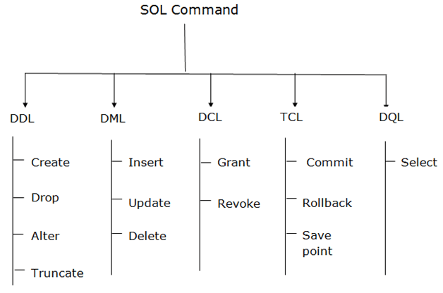

# COMPUTER SCIENCE NOTES

Maintained by [**Sadman Kabir Soumik**](https://www.linkedin.com/in/sksoumik/)

---

# Difference between constant time vs linear time

In time-complexity,

**Constant time** O(1) means, the algorithm doesn't depend on the size of the input. If the size of the data container(e.g arrays) grow/increase, the execution time for some operation will remain same.

**Linear time** O(n) means, the algorithm depends on the size of the input. If the size of the data container (e.g. arrays) increases, the execution time for some operation will also increase.

# Time complexity

`n`: input size.

| Name        | Running time                                                 | example algorithms                                    |
| ----------- | ------------------------------------------------------------ | ----------------------------------------------------- |
| constant    | O(1)                                                         | Finding the median value in a sorted array of numbers |
| logarithmic | O(log n) \|   every time n increases by an amount k, the time or space increases by k/2. | Binary search                                         |
| Linear      | O(n)                                                         | Find duplicate elements in array with hash map        |
| Loglinear   | O(n log n) \|   implies that O(log n) operations will occur n times. | Merge Sort, Heap Sort, Quick Sort                     |
| Quadratic   | O(n^2)                                                       | Bubble sort, Insertion sort                           |
| Cubic       | O(n^3)                                                       |                                                       |
| Exponential | O(2^n)                                                       | Find all subsets                                      |
| Factorial   | O(n!)                                                        | Find all permutations of a given set/string           |

See the time and space complexities [chat](https://en.wikipedia.org/wiki/Sorting_algorithm#Stability)

# Linear vs Non-linear data structures

|            Key            |                    Linear Data Structures                    |                  Non-linear Data Structures                  |      |
| :-----------------------: | :----------------------------------------------------------: | :----------------------------------------------------------: | ---- |
| Data Element Arrangement  | In linear data structure, data elements are **sequentially connected** and each element is traversable through a single run. | In non-linear data structure, data elements are hierarchically connected and are present at various levels. |      |
|          Levels           | In linear data structure, all data elements are present at a single level. | In non-linear data structure, data elements are present at multiple levels. |      |
| Implementation complexity |       Linear data structures are easier to implement.        | Non-linear data structures are difficult to understand and implement as compared to linear data structures. |      |
|         Traversal         | Linear data structures can be traversed completely in a single run. | Non-linear data structures are not easy to traverse and needs multiple runs to be traversed completely. |      |
|    Memory utilization     | Linear data structures are not very memory friendly and are not utilizing memory efficiently. |   Non-linear data structures uses memory very efficiently.   |      |
|      Time Complexity      | Time complexity of linear data structure often increases with increase in size. | Time complexity of non-linear data structure often remain with increase in size. |      |
|         Examples          |                  Array, List, Queue, Stack.                  |                      Graph, Map, Tree.                       |      |

# Difference between tree and graph

In tree, there is no cycles. In Graphs, cycles may form. 

# DFS, BFS

| DFS                                                          | BFS                                                          |
| ------------------------------------------------------------ | ------------------------------------------------------------ |
| Stack                                                        | Queue                                                        |
| LIFO                                                         | FIFO                                                         |
| Stacking Plates                                              | Queue in front of a elevator                                 |
| DFS is more suitable when there are solutions away from source. | BFS is more suitable for searching vertices which are closer to the given source. |
| when we want to know the all possible results                | when we want to find the shortest path (simple graph). we usually use bfs,it can guarantee the 'shortest'. |


# Array vs Linked List

| Operation                    | Array                                                        | LinkedList                                                   |
| ---------------------------- | ------------------------------------------------------------ | ------------------------------------------------------------ |
| Size                         | Since data can only be stored in contiguous blocks of memory in an array, its size cannot be altered at runtime due to the risk of overwriting other data. | in a linked list, each node points to the next one such that data can exist at scattered (non-contiguous) addresses; this allows for a dynamic size that can change at runtime. |
| Memory allocation            | Happens at compile time                                      | Happens at run-time                                          |
| Execution time               | Any element in an array can be directly accessed with its index. Also, better cache locality in arrays (due to contiguous memory allocation) can significantly improve performance. As a result, some operations (such as **modifying** a certain element) are faster in arrays. | In the case of a linked list, all the previous elements must be traversed to reach any element. **Inserting/deleting** an element in the data are faster in linked lists. |
| List iteration               | O(n) time                                                    | O(n) time                                                    |
| Cost of accessing an element | O(1)                                                         | O(n)                                                         |
| application                  | array better in searching                                    | linked list better in insertion and deletions                |
|                              |                                                              |                                                              |
|                              |                                                              |                                                              |


# Dynamic Programming:

Dynamic programming is used where we have problems,  which can be divided into similar sub-problems,  so that their results can be re-used. 


# Dynamic programming vs Recursion

During recursion, there may exist a case where same sub-problems are solved multiple times.
Consider the example of calculating nth fibonacci number.

```
fibo(n) = fibo(n-1) + fibo(n-2)
fibo(n-1) = fibo(n-2) + fibo(n-3)
fibo(n-2) = fibo(n-3) + fibo(n-4)
.................................
.................................
.................................
fibo(2) = fibo(1) + fibo(0)
```

In the first three steps, it can be clearly seen that `fibo(n-3)` is calculated twice. If one goes deeper into recursion, it may find repeating the same sub-problems again and again.

**Benefit of DP over Recursion:**
DP is a technique which uses a **table** to store the results of sub-problem so that if same sub-problem is encountered again in future, it could directly return the result instead of re-calculating it.

Ref: [Quora](https://qr.ae/pvo8OU)


# Polymorphism vs Overriding vs Overloading

Polymorphism means more than one form, same object performing different operations according to the requirement.

Polymorphism can be achieved by using two ways, those are

1. Method overriding
2. Method overloading

*Method overloading* means writing two or more methods **in the same class** by using same method name, but the passing parameters are different.

*Method overriding* ability of any object-oriented programming language that allows a subclass or child class to provide a specific implementation of a method that is already provided by one of its super-classes or parent classes. When a method in a subclass has the same name, same parameters or signature and same return type(or sub-type) as a method in its super-class, then the method in the subclass is said to **override** the method in the super-class.

# OOP Concepts

#### Encapsulation

Declare all variables in the class as *private*. Write public methods in the class to set and get the values of the variables. It is more defined in the setter and getter method. 

#### Abstraction

Handle complexity by hiding the unnecessary details from the user. For example, coffee machine. 

Base class won't have the implementation details, we just define a abstract method without detail implementation. Other class will inherit this class, override the abstract method and have the detail implementation. 

#### Inheritance

Child class extends a parent class. Child class can extend parent class's all public and protected methods and can have its own implementation. 

#### Polymorphism

See above. 

### Benefits of OOP

1. Modularity for easier troubleshooting. When working with OOP, we know exactly where to look at when something goes wrong. 
2. Reuse of code through inheritance. 
3. OOP systems can be easily upgraded from small scale to large scale systems. 

# Things to consider when designing REST API (Best Practices)

1. Use JSON as the Format for Sending and Receiving Data. This is because, with XML for example, it's often a bit of a hassle to decode and encode data – so XML isn’t widely supported by frameworks anymore. 

2. When you're designing a REST API, you should not use verbs in the endpoint paths. The endpoints should use nouns, signifying what each of them does. This is because HTTP methods such as `GET`, `POST`, `PUT`, `PATCH`, and `DELETE` are already in verb form for performing basic CRUD (Create, Read, Update, Delete) operations. 

   So, for example, an endpoint should not look like this:

   ```
   https://mysite.com/getPosts or https://mysite.com/createPost
   ```

   Instead, it should be something like this: `https://mysite.com/posts`

3. You should always use regular HTTP status codes in responses to requests made to your API. This will help your users to know what is going on – whether the request is successful, or if it fails, or something else. For example, 404 - Not Found. [See](https://moz.com/learn/seo/http-status-codes) the most popular codes.

4. Oftentimes, different endpoints can be interlinked, so you should nest them so it's easier to understand them.

   For example, in the case of a multi-user blogging platform, different posts could be written by different authors, so an endpoint such as `https://mysite.com/posts/author` would make a valid nesting in this case. 

5. Use SSL for Security. 

6. REST APIs should have different versions, so you don’t force clients (users) to migrate to new versions. This might even break the application if you're not careful. One of the commonest versioning systems in web development is semantic versioning. 

   Many RESTful APIs from tech giants and individuals usually comes like this:
   `https://mysite.com/v1/` for version 1
   `https://mysite.com/v2` for version 2 

7. When you make a REST API, you need to help clients (consumers) learn and figure out how to use it correctly. The best way to do this is by providing good documentation for the API.

   The documentation should contain:

   - relevant endpoints of the API
   - example requests of the endpoints
   - implementation in several programming languages
   - messages listed for different errors with their status codes. 

   

   Ref: [freecodecamp](https://www.freecodecamp.org/news/rest-api-best-practices-rest-endpoint-design-examples/) 

# Git Rebase

With a regular rebase, you can update your current branch with another branch. 

```bash
git getch origin main
# checkout to target branch
git checkout <my-feature-branch>
# rebase it against the main branch
git rebase origin/main
```

# Git Pull vs Fetch

| fetch                                                        | pull                                                         |
| ------------------------------------------------------------ | ------------------------------------------------------------ |
| Gathers any commit from the target branch to the current branch. However, it doesn't merge with the current branch. If we want to merge those changes, we must have to use `git merge` | Tries to automatically merge after fetching commits. So, all pulled commits will be merged into your currently active branch. Git pulls automatically merge the commits without letting the user review them. |

# Git Bisect

This command is uses binary search algorithm to find which commit in the project's history introduced a bug,. 

```
git bisect start
git bisect good
git bisect bad <bad commit> 
```

It tracks down the commits where the code works and where it doesn't. 

# Kubernetes main components


# Keyboard shortcuts

#### vscode

- Vscode: select the same word in the whole file: point the cursor in any word that you want to select then press `ctrl + D`
- Vscode: Open User Settings: `CTRL + ,`
- VSCode: Quick Open a File: `CTRL + P`
- VScode: Tab Through Open Files: `CTRL + Tab`
- Vscode: Move File to Split Windows = `CTRL + \ `
- Vscode: Navigating Text/ move a line up or down: Hold `ALT` when moving `left and right` through text to move faster.

#### Linux

- Move among opened tabs: `ctrl + fn + up/down arrow`
- Change workspace: `ctrl + alt + right/left arrow`
- Selecting multiple place mouse cursor: press `alt + shift + D` and then use `up/down` arrow.

#### Linux Terminal

- add a custom command in linux terminal: 

  ```bash
  alias custom_command='original_command'
  ```

- delete a folder from linux including all files 

  ```bash
  sudo rm -r folder_name
  ```

  

- get a notification with a voice after a process gets finished:

  ```bash
  some-command; spd-say "Any Voice Message"
  ```

  

- Delete all files from the current directory 

  ```bash
  sudo rm ./*
  ```

  

- Clean up root disk in Linux | dev/sda1 disk full problem

  ```bash
  sudo apt-get install ncdu
  sudo ncdu /  # too see all files size in root dir
  or
  ncdu       # (see files sizes in the current directory)
  ```

  

- Download youtube videos as mp3 youtube-dl 

  ```bash
  youtube-dl -f bestaudio --extract-audio --audio-format mp3 --audio-quality 0 <URL>
  ```

  

- Create a new file:

  ```bash
  cat filename
  ```

  

- find absolute location of a file: 

  ```bash
  readlink -f file.txt
  ```

  

- Zip a folder with a name: 

  ```bash
  zip -r file_name.zip targer_folder_name/
  ```

  

- Open a folder in file explorer using Linux Terminal:

  ```bash
  xdg-open folder
  ```

  

- copy or move files from subdirectories that ends with a common extension: 

  ```
  mv **/*.csv target_dir
  ```

  

- Install VS Code from terminal: [read here](https://linuxize.com/post/how-to-install-visual-studio-code-on-ubuntu-18-04/)

- Get the size of a file (human-readable): 

  ```
  du -sh <file-name>
  ```

  

- Search for a file in the current directory: 

  ```
  find *<file-name-portion>*
  ```

  

- rename a folder: 

  ```
  vm old_name new_name
  ```

  

- `Ctrl + L` : equivalent to `clear`

- `Ctrl + U`: This shortcut erases everything from the current cursor position to the beginning of the line.

- `Ctrl + A`: Move the cursor to the beginning of the line.

- `Ctrl + E`: This shortcut does the opposite of `Ctrl + A`. It moves the cursor to the end of the line.

- Display first 3 lines of a file in the terminal: `head -3 filename`

- ```
  sudo apt update        # Fetches the list of available updates
  sudo apt upgrade       # Installs some updates; does not remove packages
  sudo apt full-upgrade  # Installs updates; may also remove some packages, if needed
  sudo apt autoremove    # Removes any old packages that are no longer needed
  ```

- see the laptop hardware information: `sudo lshw`

- find cpu configuration: `lscpu`

- Get public IP address:

  ```
  curl ifconfig.me
  ```

- Get private IP address (IPv4 address):

  ```
  hostname -I
  ```

- unzip all zip files in a directory

  ```
  unzip \*.zip
  ```

- Rename a file

```bash
mv filename.txt newfilename.txt
```

- Move all certain types of files from all subdirectories to a target path

  If you only want to move the `.zip` files, you could do something like: 

```bash
mkdir ./zipfiles
find . -name "*.zip" -exec mv "{}" ./zipfiles \;
```

- Count the number of files in a directory

```bash
ls | wc -l
```

- Convert all png images to jpg from a directory

```bash
# Convert and keep original files:
mogrify -format jpg *.png

# Convert and remove original files:
mogrify -format jpg *.png && rm *.png
```

- Randomly delete certain number of certain types of files from the current directory:

The following code randomly deletes 1000 jpg files from the current directory.

```
find . -maxdepth 1 -type f -name "*.jpg" -print0 | head -z -n 1000 | xargs -0 rm
```


#### Anaconda commands

- create a new venv
  
  ```bash
  conda create -n myenv python=3.6
  ```
  
  
  
- create anaconda env file from terminal
  
  ```bash
  conda env export > conda.yaml
  ```
  
  
  
- Creating new anaconda environment using a yaml file: 

  ```bash
  conda env create --file dependency.yaml
  ```

  

- remove a venv from anaconda
  
  ```bash
  conda env remove -n env_name
  ```
  
  
  
- Remove any anaconda env

  ```bash
  conda env remove -n env_name
  ```

  

- Remove any package from an environment: activate the target env and then:

  ```bash
  conda remove package_name
  ```

  

- update an existing environment with a `yml` file

  ```bash
  conda activate myenv
  conda env update --file conda.yml --prune
  ```


- Install miniconda on Linux

  ```bash
  wget https://repo.anaconda.com/miniconda/Miniconda3-py38_4.10.3-Linux-x86_64.sh
  
  bash Miniconda3-py38_4.10.3-Linux-x86_64.sh
  
  cd miniconda3/bin
  source activate
  ```


#### GCP commands

- Create a GCP VM Instance: [link](https://github.com/cs231n/gcloud/)
  
- Connect with the instance from terminal:
  
  ```
  gcloud compute config-ssh
  ssh soumik.us-west1-b.project_name
  ```
  
  
  
- After creating VM Instance configure from the local PC:
  
  ```
  gcloud config set project project_name
  gcloud compute config-ssh
  ```
  
  
  
- Copy file from instance to GCP workspace:
  
  ```
  sudo gsutil cp gs://ceri_snow_unified/CERI_snow_10sec/csv/kfold.csv .
  ```
  
  
  
- Copying files from GCP instance to local computer:
  
  ```
  gsutil -m cp -r gs://project_location/ ${loca_pc_dest_path}
  ```

  for example:
  
  ```
  gsutil -m cp -r gs://ceri_snow_unified/CERI_snow_10sec/ C:/Users/Dell/code/ceri_test_windows
  ```
  
  
  
- See how much space left on GCP: 

  ```
  df -h
  ```

  

- Upload files from bucket to instance: 

  ```
  gsutil -m cp -R gs://bucket_location_gs_path .
  ```

  

- Download file from gcp bucket to an instance (. means current directory)
  
  ```
  gsutil -m cp -r gs://bucket_location .
  ```
  
  
  
- Untar files: 

  ```
  tar -xf filename.xz
  ```

  

- Transfer (copy) file from GCP instance to Cloud Storage Bucket: (run from the instance workplace)

  ```
  gsutil cp filename gs://bucket_name
  ```

  

- Transfer/Copy file/folder from Cloud Storage Bucket to the local computer: (Open terminal in your local computer and navigate to the folder where you need the file to be copied and run this command):

  ```
  gsutil -m cp -r gs://bucket_name/folder .
  ```

  

- Clean up root disk in Linux | dev/sda1 disk full problem | see which files are taking what space in the disk:

  ```
  sudo apt-get install ncdu
  sudo ncdu /              # see all file/folder size in the root directory of disk
  ```
  
  

#### Git

- Add an existing project to github

```bash
git init
git add . && git commit -m "initial commit"
git push -f origin master
```

- Create ssh key for github

```bash
ssh-keygen -t ed25519 -C "your_email@example.com"
```

- Could not open a connection to your authentication agent

```bash
eval `ssh-agent -s`
```


- See a git cheatsheet: [[here](/static/git-cheat-sheet-education.pdf)]

- github authentication error: use `gh` client. 

  ```bash
  sudo apt update
  sudo apt install gh
  gh auth login
  ```

- create a new branch without adding any content from the master branch (empty branch)

  `git checkout --orphan branchname`

  `git rm -rf .`

- revert back to a specific commit:

  `git reset --hard <commit_id>`

  `git push -f origin master`

- create a new branch and switch to it at the same time:

`git checkout -b <branch_name>`

- Add agent:

  ```shell
  eval `ssh-agent -s`
  ssh-add
  ```

- update a branch with the master:

  ```bash
  git checkout <branch_name>
  git merge main
  ```

- update the current branch with the recent changes:

  ```
  git pull origin <remote branch name>
  ```

- update the current branch with the master (if changes later after pulling the master code)

  ```
  git rebase master
  ```

- **git stage**: To stage a file is simply to prepare it finely for a commit. Git, with its index allows you to commit only certain parts of the changes you’ve done since the last commit.

  Say you’re working on two features – one is finished, and one still needs some work done. You’d like to make a commit and go home but wouldn’t like to commit the parts of the second feature, which is not done yet. You stage the parts you know belong to the first feature, and commit.
  
- Add a folder in github lfs track which contains large files (larger than 100MB):

  ```
  git lfs track "myfolder/**"
  ```


#### Elasticsearch local commands

```bash
# Reload deamon
sudo systemctl daemon-reload

# Restart the elasticsearch service
sudo systemctl restart elasticsearch
```

Run the command below to start the elasticsearch service and verify the service is running.

```bash
sudo systemctl start elasticsearch
systemctl status elasticsearch
```

Check the status of the ES:

```
sudo systemctl status elasticsearch
```

Stop the ES service:

```
sudo systemctl stop elasticsearch
```

Install plugins

```bash
sudo /usr/share/elasticsearch/bin/elasticsearch-plugin install <plugin name> 
```


### Docker

```
sudo service docker start
sudo service docker stop
sudo service docker status

sudo systemctl stop docker.socket
```


# Docker vs Kubernetes

In a nutshell, **Docker** is a suite of software development tools for creating, sharing and running individual containers; **Kubernetes** is a system for operating containerized applications at scale.

Think of containers as standardized packaging for microservices with all the needed application code and dependencies inside. Creating these containers is the domain of **Docker**. A container can run anywhere, on a laptop, in the cloud, on local servers, and even on edge devices.

A modern application consists of many containers. Operating them in production is the job of **Kubernetes**. Since containers are easy to replicate, applications can auto-scale: expand or contract processing capacities to match user demands.

Docker and Kubernetes are mostly complementary technologies—Kubernetes *and* Docker.

Ref: [Peter](https://www.dynatrace.com/news/blog/kubernetes-vs-docker/)

# Enterprise software vs Consumer software

Enterprise software is just another term for business software. This is software that is **sold to (or targeted at) companies, not to individuals.** So, all the software which you use on a general basis like Windows or **Google or Quora is consumer software.**

Enterprise software is sold to companies to solve their problems. This can cover a wide range of applications, from software to manage the employees like payroll, attendance, promotions etc. (HRM), interacting with customers like the one’s marketing, sales.

# Download speed vs Upload Speed

Download speed refers to how many megabits of data per second it takes to download data from a server in the form of images, videos, text, files and audio to your device. Activities such as listening to music on Spotify, downloading large files or streaming videos on Netflix all require you to download data.

Upload speed refers to how fast you can send information from your computer to another device or server on the internet. While downloading information is more common, some online activities need data to travel in the opposite direction. Sending emails, playing live tournament-style [video games](https://www.allconnect.com/blog/recommended-speeds-by-gaming-type) and [video calling](https://www.allconnect.com/blog/how-to-video-chat) on Zoom require fast upload speeds for you to send data to someone else’s server. 

[Ref](https://www.allconnect.com/blog/difference-between-download-upload-internet-speeds)

# Permutations vs Anagrams vs Palindromes

Check Permutation: Given two strings, write a method to decide if one is a permutation of the other.

I’m working through algorithm exercises with a group of people, and there was a lot of confusion about what permutation means, and how it differs from anagrams and palindromes.

So, to clarify:

A permutation is one of several possible variations, in which a set of things (like numbers, characters or items in an array) can be ordered or arranged. A permutation of characters does not have to have meaning.

Example: Given the string abcd, the permutations are abcd, abdc, acbd, acdb, adbc, adcb, bacd, badc, bcad, bcda, bdac, bdca, cabd, cadb, cbad, cbda, cdab, cdba, dabc, dacb, dbac, dbca, dcab and dcba

An anagram is a word, phrase, or name formed by rearranging the characters of a string. An anagram must have meaning, it can’t just be gibberish.

Example: These words are anagrams of carets: caters, caster, crates, reacts, recast, traces

A palindrome is a word, phrase, or sequence that reads the same backward as forward. A palindrome must have meaning, it can’t just be gibberish.

Example: Civic, level, madam, mom and noon are all palindromes.

All palindromes and anagrams are permutations, but not all permutations are either anagrams or palindromes.


# Concurrency and parallelism

**Concurrency** and **parallelism** both relate to "different things happening more or less at the same time.

**Concurrency** is when two or more tasks can start, run, and complete in overlapping time **periods**. It doesn't necessarily mean they'll ever both be running **at the same instant**. For example, *multitasking* on a single-core machine.

**Parallelism** is when tasks *literally* run at the same time, e.g., on a multicore processor. 

https://fastapi.tiangolo.com/async/#in-a-hurry

# Multi-threading vs multi-processing

When looking for the difference between python `multiprocessing` and `multithreading`, one might have the impression that they work pretty much the same. That could not be more wrong. The key differences are:

- A process is an independent instance executed in a processor core. Threads are components of a process and run concurrently (inside that process).
- Processes do not share the same memory space, while threads do (their mother’s memory, poetic, right?).
- Threads are lighter and cause less overhead. Also, because they share the same memory inside a process, it is easier, faster, and safer to share data.
- True parallelism can ONLY be achieved using `multiprocessing`. That is because only one thread can be executed at a given time inside a process time-space. This is assured by Python’s global interpreter lock (GIL) (see [Python GIL at RealPython](https://realpython.com/python-gil/)).
- Processes execution is scheduled by the operating system, while threads are scheduled by the GIL.

Ref: [medium](https://towardsdatascience.com/multithreading-vs-multiprocessing-in-python-3afeb73e105f)

# Daemon in Linux

A **daemon** (pronounced DEE-muhn) is a program that runs continuously and exists for the purpose of handling periodic service requests that a computer system expects to receive. The **daemon** program forwards the requests to other programs (or processes) as appropriate. For example, the **Cron** daemon is a built-in **Linux** utility that runs processes on your system at a scheduled time. We can configure a **cron** job to schedule scripts or other commands to run automatically.

# Pickle vs JSON for serialization

https://docs.python.org/3/library/pickle.html#comparison-with-json


# CRUD

In computer programming, **create, read, update, and delete** (CRUD) are the four basic functions of persistent storage.

# SQL vs NoSQL

**SQL:**

- Relational database.
- Organize data into one or more tables.
- Each table has rows and columns.
- An unique identifier is added in each row.
- B+ tree is the main data structure

Relational database management systems: mysql, postgresql, mariadb, oracle etc.

**NoSQL**

- Non-relational.
- Organize data in a key:value pair.
- Mainly documents in JSON/XML format.
- LSM-tree (Long structured merge -tree) is the main data structure.

NoSQL management systems: MongoDB, firebase, apache cassandra etc.

**Foreign key** is just the primary key of another table. So that we can make a relationship between two tables.

**LSM-tree**: read [here](http://www.shafaetsplanet.com/?p=3796)

# SQL Basics

##### Basic statements

- SQL statements fall into two different categories: Data Definition Language (DDL) statements and Data Manipulation Language (DML) statements.

  

Read more details from [here](https://www.javatpoint.com/dbms-sql-command)

**Query statement (retrieve data): ** SELECT

**DDL (data definition language)**: Create, Drop, Alter, Truncate

**DML (Data manipulation language) statement:** INSERT, UPDATE, DELETE

##### Select Rule | Query data from a table

```sql
SELECT column_name
FROM Table_name
WHERE Conditions;
```

##### Insert Rule | Inser new data in a table

```sql
INSERT INTO table_name (column1, column2, ... )
VALUES (value1, value2, ... );
```

Example, insert one row

```sql
INSERT INTO Instructor(ins_id, lastname, firstname, city, country)
VALUES(4, 'Saha', 'Sandip', 'Edmonton', 'CA');
```

Example, insert multiple row

```sql
INSERT INTO Instructor(ins_id, lastname, firstname, city, country)
VALUES(5, 'Doe', 'John', 'Sydney', 'AU'), (6, 'Doe', 'Jane', 'Dhaka', 'BD');
```

##### Update Rule | Alter information in a table

```sql
UPDATE table_name
SET column1 = value1, column2 = value2, ...
WHERE condition;
```

Example, update data

```sql
UPDATE Instructor
SET city='Toronto'
WHERE firstname="Sandip";
```

Example, update multiple columns

```sql
UPDATE Instructor
SET city='Dubai', country='AE'
WHERE ins_id=5;
```

##### Delete | Remove one or more rows from a table

```sql
DELETE FROM table_name
WHERE condition;
```

Example, delete one row from the table

```sql
DELETE FROM Instructor
WHERE ins_id = 6;
```

##### Delete vs Drop vs Truncate 

**DROP** command is used to **remove schema, table**, domain or Constraints from the database. 

**Truncate** command is used to **delete the data inside a table**, but not the table itself.

**DELETE** command is used to remove **some or all the tuples** from the table. 

**Rollback**: One can make use of this command if they wish to **undo any changes** or alterations since the execution of the last COMMIT.	

##### JOIN statement

A SQL Join statement is used to combine data or rows from two or more tables based on a common field between them. Different types of Joins are:

- INNER JOIN
- LEFT JOIN
- RIGHT JOIN
- FULL JOIN

##### Aggregate Functions

An aggregate function performs a calculation on a set of values, and returns a single value. Except for `COUNT(*)`, aggregate functions ignore null values. Aggregate functions are often used with the `GROUP BY` clause of the SELECT statement.

Various aggregate functions are:

```sql
1) Count()
2) Sum()
3) Avg()
4) Min()
5) Max()
```

##### Few clauses that is used with the select statement

**COUNT:** retrieves the number of rows

**DISTINCT** is used to remove duplicate values from a result set.

**LIMIT**: restricting the number of rows retrieved from the database.

##### Union vs Join: 

Join: It combines data into new columns.

Union: It combines data into new rows. 

```sql
SELECT Name 
FROM Boys 
WHERE Rollno < 16 

UNION

SELECT Name 
FROM Girls 
WHERE Rollno > 9 


Result: 
------------------
Name
-------------------
Soumik
Sadman
Kabir
Khan
Zara
Kona
Rini
Mini
.... 

```

```sql
SELECT Boys.Name, Boys.Age, Girls.Address,
FROM Boys 
INNER JOIN Girls 
ON Boys.Rollno = Girls.Rollno; 

Result
-------------------
Name     Age      Address
-------------------------
Soumik   27		  Dhaka
Kabir    31       New York
....   ....       ..... 
```


## Entity -relationship diagrams

Entity: Table

Attribute: Columns

##### Data type, CHAR vs VARCHAR

A CHAR field is a *fixed* length, and VARCHAR is a *variable* length field.

This means that the storage requirements are different - a CHAR always takes the same amount of space regardless of what you store, whereas the storage requirements for a VARCHAR vary depending on the specific string stored. 

CHAR fields are stored inside the register due to its size being known, this makes searching and indexing faster. 

##### Indexing in DB

Consider a "Book" of 1000 pages, divided by 10 Chapters, each section with 100 pages.

Now, imagine you want to find a particular Chapter that contains a word "**Alchemist**". Without an index page, you have to scan through the entire book/Chapters. i.e: 1000 pages.

This analogy is known as **"Full Table Scan"** in database world.


But with an index page, you know where to go! And more, to lookup any particular Chapter that matters, you just need to look over the index page, again and again, every time. After finding the matching index you can efficiently jump to that chapter by skipping the rest.

But then, in addition to actual 1000 pages, you will need another ~10 pages to show the indices, so totally 1010 pages.

> Thus, the index is a separate section that stores values of indexed column + pointer to the indexed row in a sorted order for efficient look-ups.


##### Foreign 

Foreign Key references the primary key of another Table! It helps connect your Tables. 

##### Normalization

Normalization is a **database design technique** that reduces data redundancy and eliminates undesirable characteristics like Insertion, Update and Deletion Anomalies. Normalization rules divides larger tables into smaller tables and links them using relationships.

If a table is not properly normalized and have data redundancy then it will not only eat up extra memory space but will also make it difficult to handle and update the database, without facing data loss. Insertion, Updation and Deletion Anomalies are very frequent if database is not normalized.

###### 1NF

1. It should only have single valued attributes/columns.
2. All the columns in a table should have unique names.
2. Values stored in a column should be of the same domain. 

###### 2NF

1. Should be in 1NF.
2. Records should not depend on anything other than a table's primary key. 

##### 3NF

1. satisfy 2NF.
5. Has no transitive functional dependencies. 

(A transitive [functional dependency is when changing a non-key column, might cause any of the other non-key columns to change. 


# SQLite Database Creation: Flask

```sql
$ sqlite3 database.db
$ .tables
$ .exit
# define the database path code.
$ python
$ from app import db
$ db.create_all()
$ exit()
# open the database
$ sqlite3 database.db
$ .tables
$ select * from table_name
```


# CMOS

Stands for "Complementary Metal Oxide Semiconductor." It is a technology used to produce integrated circuits. **CMOS** circuits are found in several types of electronic components, including microprocessors, batteries, and digital camera image sensors.

# Profiling

In software engineering, profiling is a form of dynamic program analysis that measures, for example, the space or time complexity of a program, the usage of particular instructions, or the frequency and duration of function calls. Most commonly, profiling information serves to aid program optimization.

# Babel

**Babel** is a **transpiler** that converts our ultra-modern JavaScript syntax to browser-readable JavaScript, HTML, and CSS.

# HTML class vs ID

The **difference** between an **ID** and a **class** is that an **ID** is only used to identify **one single element** in our **HTML**. ... However, a **class** can be used to identify more than one **HTML** element.

# Vue.js commands

```bash
# check vue version
$ vue --version
# create the app from the current directory
$ vue create <app-name>
# run the app to browser
$ npm run serve

```

# Abstract class

An **abstract class** is a **class** that is declared **abstract** —it may or may not include **abstract** methods. **Abstract classes** cannot be instantiated, but they can be subclassed. Abstract classes are classes that contain one or more abstract methods. An abstract method is a method that is declared, but contains **no implementation**. Abstract classes **cannot be instantiated**, and require subclasses to provide implementations for the abstract methods.

Python on its own doesn't provide abstract classes. Yet, Python comes with a module which provides the infrastructure for defining Abstract Base Classes (ABCs). This module is called - for obvious reasons - **abc**.

The following Python code uses the abc module and defines an abstract base class:

```python
from abc import ABC, abstractmethod

class AbstractClassExample(ABC):

    def __init__(self, value):
        self.value = value
        super().__init__()

    @abstractmethod
    def do_something(self):
        pass
```

We will define now a subclass using the previously defined abstract class. You will notice that we haven't implemented the `do_something` method, even though we are required to implement it, because this method is **decorated** as an abstract method with the decorator "`abstractmethod`". We get an exception that Add42 can't be instantiated.

```python
class Add42(AbstractClassExample):
    pass

x = Add42(4)
```

Output:

```bash
---------------------------------------------------------------------------
TypeError                                 Traceback (most recent call last)
<ipython-input-4-2bcc42ab0b46> in <module>
      2     pass
      3
----> 4 x = Add42(4)

TypeError: Can't instantiate abstract class Add42 with abstract methods do_something
```

We will do it the correct way in the following example, in which we define two classes inheriting from our abstract class:

```python
class Add42(AbstractClassExample):

    def do_something(self):
        return self.value + 42

class Mul42(AbstractClassExample):

    def do_something(self):
        return self.value * 42

x = Add42(10)
y = Mul42(10)

print(x.do_something())
print(y.do_something())
```

```bash
52
420
```

Read [more...](https://www.python-course.eu/python3_abstract_classes.php)

# Python collections module

Read [here](https://docs.python.org/3/library/collections.html#module-collections)

### 

# Static method vs Instance method

##### Static Method

Static methods are methods that can be called without creating an object of the class. They can be just called by referring the class name. For example: if we have a class:

```javascript
class ClassName {
  static getPosts() {}
}
```

Then, I don't need to create an object like `obj = new ClassName()` something like this. I can directly call `ClassName.getPosts()`.

Pythonic way to create a static method: Most common form is to put a `@staticmethod` decorator on top of the function.

```python
class MyClass:
    @staticmethod
    def hello():
        print('static method called')
```

```bash
# way to call a static method
>>> MyClass.hello()
```

Output:

```
static method called
```

##### Instance Method

Pythonic way to create an instance method: Instance method must contain a self parameter.

```python
class MyClass:
    def instance_method(self):
        return 'instance method called', self
```

#### When do we want to use a `static` method?

1. Static methods are used when we don't want subclasses of a class change/override a specific implementation of a method.
2. A particular piece of code is to be shared by all the instance methods.
3. If you are writing utility classes and they are not supposed to be changed.

# What is the purpose of self keyword in Python?

`self` represents the instance of the class. By using the “self” keyword we can access the attributes and methods of the class in python.

Let's say you have a class `ClassA` which contains a method `methodA` defined as:

```python
def methodA(self, arg1, arg2):
    # do something
```

and `ObjectA` is an instance of this class.

Now when `ObjectA.methodA(arg1, arg2)` is called, python internally converts it for you as:

```python
ClassA.methodA(ObjectA, arg1, arg2)
```

The `self` variable refers to the object itself. The `self` parameter is a reference to the **current instance of the class**, and is used to access variables that belongs to the class. It does not have to be named `self` , you can call it whatever you like, but it has to be the first parameter of any function in the class.

# None keyword in python

The `None` keyword is used to define a null value, or no value at all. `None` is not the same as 0, `False`, or an empty string. None is a data type of its own (NoneType) and only None can be `None`. 

# list pop()

Code:

```python
queue = [1, 2, 3]
queue.pop()  # delete the last item
print(queue)
```

Output:

```
[1, 2]
```

Code:

```python
queue = [1, 2, 3]
queue.pop(0)  # delete the first item
print(queue)
```

Output:

```
[2, 3]
```

# List comprehension in Python

code:

```python
words = ['data','science','machine','learning']

#for loop
a = []
for word in words:
   a.append(len(word))

#list comprehension
b = [len(word) for word in words]

print(f"a is {a}")
print(f"b is {b}"
```

output:

```bash
a is [4, 7, 7, 8]
b is [4, 7, 7, 8]
```

code:

```python
#for loop
a = []
for word in words:
   if len(word) > 5:
    	a.append(word)

#list comprehension
b = [word for word in words if len(word) > 5]

print(f"a is {a}")
print(f"b is {b}")
```

output:

```bash
a is ['science', 'machine', 'learning']
b is ['science', 'machine', 'learning']
```

code:

```python
#for loop
a = []
for word in words:
  for letter in word:
    if letter in ["a","e","i"]:
       a.append(letter)


# list comprehension
b = [letter for word in words for letter in word if letter in ["a","e","i"]]
```

Read [more](https://towardsdatascience.com/crystal-clear-explanation-of-python-list-comprehensions-ac4e652c7cfb)..


# List and Tuple difference

| List                                        | Table                                       |
| ------------------------------------------- | ------------------------------------------- |
| Lists are mutable, means they can be edited | Tuples are immutble, means can't be edited. |
| Lists are slower than tuples.               | Tuples are faster.                          |

# What is the difference between Python Arrays and lists?

Arrays and lists, in Python, have the same way of storing data. But, arrays can hold only a **single data type** elements whereas lists can hold **any data type** elements.


# Difference between HashTable and HashMap

| Hash MAP                                      | Hash Table                            |
| --------------------------------------------- | ------------------------------------- |
| Not synchronized. So, it's not thread-safe.   | Synchronized. Means it's thread-safe. |
| Allows one null key and multiple null values. | Doesn't allow any null key or value.  |

Python **dictionaries** are based on a well-tested and finely tuned **hash table** implementation that provides the performance characteristics you’d expect: **_O_(1)** time complexity for lookup, insert, update, and delete operations in the average case.

Python's `set()` also uses hashtable as its underlying data structure.


# Synchronized

`synchronized` means that in a multi threaded environment, an object having `synchronized` method(s)/block(s) does not let two threads to access the `synchronized` method(s)/block(s) of code at the same time. This means that one thread can't read while another thread updates it.


# How does the Google "Did you mean?" algorithm work?

Basically and according to Douglas Merrill former CTO of Google it is like this:

1. You write a ( misspelled ) word in Google.

2. You don't find what you wanted ( don't click on any results ).

3. You realize you misspelled the word so you rewrite the word in the search box.

4. You find what you want ( you click in the first links ).

This pattern multiplied millions of times, shows what are the most common misspells and what are the most "common" corrections.

This way Google can almost instantaneously, offer spell correction in every language.

Also this means if overnight everyone start to spell night as "nigth", Google would suggest that word instead. Douglas describe it as "statistical machine learning".

# Proxy Server

PS is an intermediate server between client and the Internet. Proxy servers offers the following basic functionalities:

- Firewall and network data filtering.
- Network connection sharing
- Data caching

##### Purpose of Proxy Servers:

- Monitoring and Filtering:
- Improving performance
- Translation
- Accessing services anonymously
- Security

Read more from [here](https://www.tutorialspoint.com/internet_technologies/proxy_servers.htm)

# SQL vs NoSQL: what’s the best option for you?

**1 . Data structure**

The first and primary factor in making the SQL vs. NoSQL decision is what your data looks like. If your data is primarily structured, a SQL database is likely the right choice. A SQL database is a great fit for transaction-oriented systems such as customer relationship management tools, accounting software, and e-commerce platforms. Each row in a SQL database is a distinct entity (e.g. a customer), and each column is an attribute that describes that entity (e.g. address, job title, item purchased, etc.). [Read more ...](https://www.thorntech.com/sql-vs-nosql/)

NoSQL examples:

1. Big data applications.
2. Rapidly growing application that needs scalability.
3. Social Media (e.g. Facebook)
4.

SQL (MongoDB, Redis, Cassandra) examples:

1. Transaction systems.
2. Banking systems.
3. Customer relationship systems.
   1. E-commerce.


# Difference between JPG and PNG

**PNG** stands for Portable Network Graphics, with so-called “lossless” compression.

JPEG or **JPG** stands for Joint Photographic Experts Group, with so-called “lossy” compression.

**JPEG** uses lossy compression algorithm and image may lost some of its data whereas **PNG** uses lossless compression algorithm and no image data loss is present in **PNG** format.


# Web Server

1. Apache HTTP Server
2. Gunicorn
3. Nginx (Engine-X) requires a JSON configuration
4. Unicorn

ASGI (Asynchronous Server Gateway Interface) server implementation

5. Uvicorn

# Metadata

Metadata is "data that provides information about other data". In other words, it is "data about data".

# Docker Basics

###### Containerization

Usually, in the software development process, code developed on one machine might not work perfectly fine on any other machine because of the dependencies. This problem was solved by the containerization concept. So basically, an application that is being developed and deployed is bundled and wrapped together with all its configuration files and dependencies. This bundle is called a container. Now when you wish to run the application on another system, the container is deployed which will give a bug-free environment as all the dependencies and libraries are wrapped together. Most famous containerization environments are Docker and Kubernetes.

###### What is Docker Compose? What can it be used for?

Docker Compose is a tool that lets you define multiple containers and their configurations via a YAML or JSON file. The most common use for Docker Compose is when your application has one or more dependencies, e.g., MySQL or Redis. Normally, during development, these dependencies are installed locally—a step that then needs re-doing when moving to a production setup. You can avoid these installation and configuration parts by using Docker Compose.

Once set up, you can bring all of these containers/dependencies up and running with a single `docker-compose up` command.

###### If you wish to use a base image and make modifications or personalize it, how do you do that?

You pull an image from docker hub onto your local system

It’s one simple command to pull an image from docker hub:

```
$ docker pull <image_name>
```

###### How do you create a docker container from an image?

Pull an image from docker repository with the above command and run it to create a container. Use the following command:

```
$ docker run -it -d <image_name>
```

`-d` means the container needs to start in the detached mode.

###### How do you list all the running containers?

The following command lists down all the running containers:

```
$ docker ps
```

###### Suppose you have 3 containers running and out of these, you wish to access one of them. How do you access a running container?

The following command lets us access a running container:

```
$ docker exec -it <container id> bash
```

###### **Can I use JSON instead of YAML for my compose file in Docker?**

You can use JSON instead of YAML for your compose file, to use JSON file with compose, specify the JSON filename to use, for eg:

```
$ docker-compose -f docker-compose.json up
```


# Class Method vs Static Method in Python

A **staticmethod** is a method that knows nothing about the class or instance it was called on. It just gets the arguments that were passed, no implicit first argument. We can use static method to create utility functions. It's a way of putting a function into a class (because it logically belongs there), while indicating that it does not require access to the class.

**With classmethods**, the class of the object instance is implicitly passed as the first argument instead of `self`.

To decide whether to use [@staticmethod](https://docs.python.org/3/library/functions.html?highlight=staticmethod#staticmethod) or [@classmethod](https://docs.python.org/3.5/library/functions.html?highlight=classmethod#classmethod) you have to look inside your method. **If your method accesses other variables/methods in your class then use @classmethod**. On the other hand, if your method does not touches any other parts of the class then use @staticmethod.

```python
class Apple:

    _counter = 0

    @staticmethod
    def about_apple():
        print('Apple is good for you.')

        # note you can still access other member of the class
        # but you have to use the class instance
        # which is not very nice, because you have repeat yourself
        #
        # For example:
        # @staticmethod
        #    print('Number of apples have been juiced: %s' % Apple._counter)
        #
        # @classmethod
        #    print('Number of apples have been juiced: %s' % cls._counter)
        #
        #    @classmethod is especially useful when you move your function to other class,
        #       you don't have to rename the class reference

    @classmethod
    def make_apple_juice(cls, number_of_apples):
        print('Make juice:')
        for i in range(number_of_apples):
            cls._juice_this(i)

    @classmethod
    def _juice_this(cls, apple):
        print('Juicing %d...' % apple)
        cls._counter += 1
```


# Database basics

###### Volatile vs Non-volatile

Volatile: Power-off -> Data lost

Non-Volatile: Power-off -> Still data remains.

###### Different ERD schemas:

1. Star schema
2. Constellation schema
3. Snowflake schema

###### Database vs Data warehouse

Database is a collection of related data that represents some elements of the real world whereas Data warehouse is an information system that stores historical and commutative data from single or multiple sources. **Database is designed to record data whereas the Data warehouse is designed to analyze data.**

DB: designed for record/store data.

DW: designed for analyzing data.

# Joins in SQL


Outer is Optional. 

So following list shows join equivalent syntaxes with and without **OUTER**

```sql
LEFT OUTER JOIN => LEFT JOIN
RIGHT OUTER JOIN => RIGHT JOIN
FULL OUTER JOIN => FULL JOIN
INNER JOIN => JOIN
```


# How Django works

1. The entry point to Django applications are URLs.  URLs could be as simple as www.example.com, or more complex like www.example.com/whatever/you/want/. When a user accesses a URL, Django will pass it to a view for processing.
2. Requests are Processed by Views. Django Views are custom Python code that get executed when a certain URL is accessed. Views can be as simple as returning a string of text to the user. They can also be made complex, querying databases, processing forms, processing credit cards, etc. Once a view is done processing, a web **response** is provided back to the user. 
3. Most often these web responses are HTML web page, showing a combination of text and images. These pages are created using Django's templating system.

# RSS feeds

Its another format like html pages. RSS feeds are created using XML. 

## What is a back-end?

The back-end is all of the technology required to **process the incoming request and generate and send the response to the client**. This typically includes three major parts:

- The server. This is the computer that receives requests.
- The app. This is the application running on the server that listens for requests, retrieves information from the database, and sends a response.
- The database. Databases are used to organize and persist data.
- The middlewares. Middleware is any code that executes between the server receiving a request and sending a response. 

###### Server

A server is simply a computer that listens for incoming requests. The server runs an app that contains logic about how to respond to various requests based on the [HTTP verb](https://developer.mozilla.org/en-US/docs/Web/HTTP/Methods) and the [Uniform Resource Identifier (URI)](https://developer.mozilla.org/en-US/docs/Glossary/URI). The server should not send more than one response per request. 

###### Routing

The pair of an HTTP verb and a URI is called a *route* and matching them based on a request is called *routing*.

###### Middlewares

Middleware is any code that executes between the server receiving a request and sending a response. These middleware functions might modify the request object, query the database, or otherwise process the incoming request. Middleware functions typically end by passing control to the next middleware function, rather than by sending a response.

Eventually, a middleware function will be called that ends the request-response cycle by sending an HTTP response back to the client.

# Transfer data between client and server

HTTP, FTP, SCP are the common File Transfer Protocols. 

The basic point that distinguishes HTTP and FTP is that **HTTP** on request provides a web page from a web server to web browser. On another side, **FTP** is used to upload or download file between client and server.

# The difference between SOAP and REST 

Web services are categorised into two types: SOAP and REST. Typically SOAP and REST are the methods used to call the web services. There are several differences between SOAP and REST. Firstly SOAP relies on XML to assist the services while REST can support various formats such as HTML, XML, JSON, etc. Another significant difference is that SOAP is a protocol. 

SOAP -> XML

REST -> JSON, HTML, XML 

# REST API using Flask

##### When to create an API

In general, consider an API if:

1. Your data set is large, making download via FTP unwieldy or resource-intensive.
2. Your users will need to access your data in real time, such as for display on another website or as part of an application.
3. Your data changes or is updated frequently.
4. Your users only need access to a part of the data at any one time.
5. Your users will need to perform actions other than retrieve data, such as contributing, updating, or deleting data.

If you have data you wish to share with the world, an API is one way you can get it into the hands of others. However, APIs are not always the best way of sharing data with users. If the size of the data you are providing is relatively small, you can instead provide a “data dump” in the form of a downloadable JSON, XML, CSV, or SQLite file. Depending on your resources, this approach can be viable up to a download size of a few gigabytes.

##### **REST (REpresentational State Transfer)** 

is a philosophy that describes some best practices for implementing APIs.

REST means when a client machine places a request to obtain information about resources from a server, the server machine then transfers the current state of the resource back to the client machine.

There are a few methods in this which are as follows.

- **GET** –  select or retrieve data from the server
- **POST** – send or write data to the server
- **PUT** – update existing data on the server
- **DELETE** – delete existing data on the server


##### Create REST using Flask

Flask-RESTful  can be used to build REST APIs. 

# Why do we need to define a constructor

A constructor is generally used to set initial values for any of the fields (aka variables). It may also be used to “set up” anything you need for a class when you instantiate it.

A constructor is a method that is only called at the time of instantiation. You cannot ever explicitly call it, therefore, if you ever want to change the value of a field, you have to create methods other than the constructor to do so.

You don’t have to create a constructor at all. A default constructor will run anyway and set all fields to zero, null, etc., so if that’s all you plan to do, don’t bother.

Additionally, you can create overloaded constructors for different situations. You can have constructors that set values for any combination of variables and you can specify whether those values come from the program instantiating the class.

# Compile time vs Run time

**Compile-time:** the time period in which you, the developer, are compiling your code.

**Run-time:** the time period which a user is running your piece of software.

# Interpreted language vs compiled language

We need to convert our source code (high-level language) into binary machine code (low-level), so that our computer can understand it. There are mainly two ways to do these translations. 

1. Compiling the source code. 
2. Interpreting the source code.

Luckily as a programmer, we don't need to worry about these things, because the languages themselves take care of these things, unless we are designing a programming language by ourselves. 


Now let's think of a scenario where I am the programmer and you are a consumer. Now I want to send my coded application to you.

One way to do this is that I compile my source code in my computer using a compiler, which will take my human readable source code, and translate it into a binary machine code. At this point, I have two files, one is the original source code, another one is the machine executable binary code. Now, I can't send my executable binary file to the consumers so that the consumers can run my application. I don't need to send the source code to the consumers. Compiled languages mainly work in this way. Examples of compiled languages: C, C++, Rust, Go. 

Second way to distribute my program to the consumers is to give the source code to the consumer by interpreting my program. In this case, I send the actual source code to the consumer instead of the executable binary file. Then the consumer can download an interpreter that can execute my source code and run it **on the fly**. In this case, the interpreter goes through one line at a time of the source code and convert it to the equivalent binary code, and run it immediately before going to the next line. Examples of interpreted languages: Python, JavaScript, Ruby, PHP. 

Benefits of compiled languages:

1. It's always ready to run. Once it is compiled and I have the executable binary file, I can send that file to millions of consumers immediately. 
2. It can be optimized for CPU usage. So, it is often faster. 
3.  The source code is private. 

Disadvantages/ downsides of compiled languages:

1. If I compile it on PC, then that executable file will not work on Mac. It often needs to execute separately even for different types of CPU on the same operating system. 

Benefits of interpreted languages:

1. We don't need to care about what kind of machine we are working on. Because we don't distribute the executable file, we only send the source code. So, it is more portable and flexible across different platforms. 
2. It is also easier to test and debug because you only need to write your source code and test it. 

Disadvantages/ downsides of interpreted languages:

1. Slower compared to compiled languages.
2. An interpreter is required. 
3. Source code is public. 

But nowadays, most interpreted languages uses JIT (Just-in-time compilation), which makes interpreted languages faster. Read [here](https://medium.com/young-coder/the-difference-between-compiled-and-interpreted-languages-d54f66aa71f0). 

# Loose Coupling vs Tight Coupling

Loose coupling implies that services are independent so that changes in one service will not affect any other. The more dependencies you have between services, the more likely it is that changes will have wider, unpredictable consequences.

In a tightly coupled system, your performance is largely dictated by your slowest component. For example, microservice architectures with services that collaborate via HTTP-based APIs can be vulnerable to cascading performance problems where one component slows down. If your services are decoupled, you will have more freedom to optimise them individually for specific workloads.


# Get vs Post request

`GET` is used for viewing something, without changing it, while `POST` is used for changing something. For example, a search page should use `GET` to get data while a form that changes your password should use `POST`. Essentially `GET` is used to retrieve remote data, and `POST` is used to insert/update remote data.

#### Get

- GET requests can be cached
- GET requests remain in the browser history
- GET requests can be bookmarked
- GET requests should never be used when dealing with sensitive data
- GET requests have length restrictions
- GET requests are only used to request data (not modify)

#### Post

- POST requests are never cached
- POST requests do not remain in the browser history
- POST requests cannot be bookmarked
- POST requests have no restrictions on data length


# Distributed computing vs Parallel computing

#### Parallel Computing

In parallel computing multiple processors performs multiple tasks assigned to them simultaneously. Memory in parallel systems can either be shared or distributed. Parallel computing provides concurrency and saves time and money.

#### Distributed Computing

In distributed computing we have multiple autonomous computers which seems to the user as single system. In distributed systems there is no shared memory and computers communicate with each other through message passing. In distributed computing a single task is divided among different computers.


| Parallel                                           | Distributed                                                  |
| -------------------------------------------------- | ------------------------------------------------------------ |
| Many operations are performed simultaneously       | System components are located at different locations         |
| Single computer is required                        | Uses multiple computers                                      |
| Multiple processors perform multiple operations    | Multiple computers perform multiple operations               |
| Processors communicate with each other through bus | Computer communicate with each other through message passing. |

# Why do use CSRF token? 

A CSRF token is a secure random token (e.g., synchronizer token or challenge token) that is used **to prevent CSRF attacks**. The token needs to be unique per user session and should be of large random value to make it difficult to guess. A CSRF secure application assigns a unique CSRF token for every user session.

# GCP and AWS Equivalent Service names

| GCP               | AWS                             |
| ----------------- | ------------------------------- |
| Cloud Storage     | S3 (Simple Storage Service)     |
| Compute Engine    | EC2 (Elastic Compute Cloud)     |
| BigQuery          | Redshift                        |
| Cloud Functions   | Lambda                          |
| App Engine        | Elastic beanstalk               |
| Kubernetes Engine | ECS (Elastic Container Service) |
| Cloud Firestore   | DynamoDB                        |
| Dataflow          | Amazon Kinesis                  |
| Dataproc          | EMR - Elastic MapReduce         |

Ref: https://cloudhawk.io/blog/aws/hybrid/cloud/2019/05/02/aws-gcp-service-equivalence.html

# Docker vs Kubernetes vs Docker Swarm

https://youtu.be/9_s3h_GVzZc

# Caching

Caching is also useful when retrieving data from a server. Instead of requesting the server every time we need data, we can store (cache) the data locally. Though, we may need a caching strategy if we have limited cache space or if the cached data can change over time.

The caching can also be implemented on the server itself. Instead of querying a database every time a user loads a page, we can cache the content and serve it to users from the cache. Then, update our cache every once in a while. 

There are different caching strategies like: 

FIFO, LIFO and LRU

#### Least Recently Used (LRU)

This is probably the most famous strategy. The name says it all. It evicts the least recently used value. But what does that mean?

When you call the cached function, the results are added to the cache (that is how caching works). But when you call the cached function with a value that is already cached, it returns the cached value and puts it at the top of the cache.
When the cache is full the bottom-most value is removed.

In this strategy, recently used entries are most likely to be reused.

[Ref](https://towardsdatascience.com/make-your-python-code-run-faster-with-caching-87bee85e9002)


